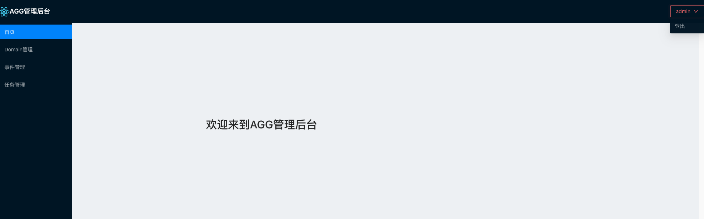

# dashboard embedded模式部署
存储模式为embedded模式，支持存储类型有redis、jdbc、rocksdb、memory等  
安装部署如下：
## 安装并部署
下载最新[RELEASE](https://github.com/changmingxie/aggregate-framework/releases)版本
### linux/mac环境

**创建dashboard目录**
```shell script
makdir dashboard 
cd  dashboard  
```
**下载aggregate-framework-dashboard-xxx.tar.gz**，解压到dashboard目录  
```shell script
dashboard % tar zxvf aggregate-framework-dashboard-4.0.0-SNAPSHOT.tar.gz
x conf/application.yaml
x lib/aggregate-framework-dashboard.jar
x conf/
x conf/logback.xml
x bin/
x bin/startup.sh
x bin/startup.cmd
x bin/shutdown.sh
x bin/shutdown.cmd
dashboard % tree
.
├── aggregate-framework-dashboard-4.0.0-SNAPSHOT.tar.gz
├── bin
│   ├── shutdown.cmd
│   ├── shutdown.sh
│   ├── startup.cmd
│   └── startup.sh
├── conf
│   ├── application.yaml
│   └── logback.xml
└── lib
    └── aggregate-framework-dashboard.jar

3 directories, 8 files
dashboard % 
```
conf/application.yaml配置[详见](/zh-cn/aggdocs/tutorial/configurations.html#dashbaord)  
  
**启动dashboard**
```shell script
sh bin/startup.sh
```
**停止dashboard**
```shell script
sh bin/shutdown.sh
```
### windows环境  
- 创建dashboard目录。
- 下载aggregate-framework-dashboard-xxx.zip，到dashboard目录，并解压。
- 双击bin/startup.cmd，启动dashboard。
- 双击bin/shutdown.cmd，停止dashboard。

### 打开dashbaord
默认地址为：http://localhost:22332/aggregate-framework-dashboard  
默认用户名密码: admin/123456
  


## 支持存储类型
当前支持的存储类型有
- memory
- rocksdb
- jdbc
- redis
- shard-redis
- redis-cluster
### memory
dashboard embedded模式下存储类型为memory，实际意义不大，不过可以方便演示dashboard基本功能  
application.yaml可如下配置  
```yaml
server:
  servlet:
    context-path: /aggregate-framework-dashboard
  port: 22332

logging:
  level:
    root: info
spring:
  application:
    name: aggregate-framework-dashboard
  resources:
    static-locations: classpath:templates/
    chain:
      cache: false
  freemarker:
    enabled: true
    cache: false
    charset: UTF-8
    suffix: .html
    check-template-location: true
    template-loader-path: classpath:/templates/
  agg:
    dashboard:
      connection-mode: embedded
    registry:
      registry-role: dashboard
    storage:
      storage-type: memory
```

### rocksdb
application.yaml可使用存储类型可以如下配置  
```yaml
server:
  servlet:
    context-path: /aggregate-framework-dashboard
  port: 22332

logging:
  level:
    root: info
spring:
  application:
    name: aggregate-framework-dashboard
  resources:
    static-locations: classpath:templates/
    chain:
      cache: false
  freemarker:
    enabled: true
    cache: false
    charset: UTF-8
    suffix: .html
    check-template-location: true
    template-loader-path: classpath:/templates/
  agg:
    dashboard:
      connection-mode: embedded
    registry:
      registry-role: dashboard
    storage:
      storage-type: rocksdb

```

### jdbc
下载[mysql脚本](https://github.com/changmingxie/aggregate-framework/blob/master-4.x/aggregate-framework-core/src/main/dbscripts/db.sql)
application.yaml可使用存储类型可以如下配置  
```yaml
server:
  servlet:
    context-path: /aggregate-framework-dashboard
  port: 22332

logging:
  level:
    root: info
spring:
  application:
    name: aggregate-framework-dashboard
  resources:
    static-locations: classpath:templates/
    chain:
      cache: false
  freemarker:
    enabled: true
    cache: false
    charset: UTF-8
    suffix: .html
    check-template-location: true
    template-loader-path: classpath:/templates/
  agg:
    dashboard:
      connection-mode: embedded
    registry:
      registry-role: dashboard
    storage:
      storage-type: jdbc
      jdbc:
        driver-class: com.mysql.jdbc.Driver
        jdbc-url: jdbc:mysql://127.0.0.1:3306/AGG?useSSL=false&connectTimeout=1000&socketTimeout=5000
        username: root
        password: welcome1
```


### reids
application.yaml可使用存储类型可以如下配置  
```yaml
server:
  servlet:
    context-path: /aggregate-framework-dashboard
  port: 22332

logging:
  level:
    root: info
spring:
  application:
    name: aggregate-framework-dashboard
  resources:
    static-locations: classpath:templates/
    chain:
      cache: false
  freemarker:
    enabled: true
    cache: false
    charset: UTF-8
    suffix: .html
    check-template-location: true
    template-loader-path: classpath:/templates/
  agg:
    dashboard:
      connection-mode: embedded
    registry:
      registry-role: dashboard
    storage:
      storage-type: redis
      redis:
        host: 127.0.0.1
        port: 6379
        database: 0
        pool-config:
          max-total: 100
          max-idle: 100
          min-idle: 10
          max-wait-millis: 300
```

### shard-reids
application.yaml可使用存储类型可以如下配置  
```yaml
server:
  servlet:
    context-path: /aggregate-framework-dashboard
  port: 22332

logging:
  level:
    root: info
spring:
  application:
    name: aggregate-framework-dashboard
  resources:
    static-locations: classpath:templates/
    chain:
      cache: false
  freemarker:
    enabled: true
    cache: false
    charset: UTF-8
    suffix: .html
    check-template-location: true
    template-loader-path: classpath:/templates/
  agg:
    dashboard:
      connection-mode: embedded
    registry:
      registry-role: dashboard
    storage:
      storage-type: shard_redis
      shard-redis:
        nodes:
          - host: 127.0.0.1
            port: 6379
          - host: 127.0.0.1
            port: 6380
          - host: 127.0.0.1
            port: 6381
```

### reids-cluster
redis集群搭建可[参考](http://www.redis.cn/topics/cluster-tutorial.html)
application.yaml可使用存储类型可以如下配置  
```yaml
server:
  servlet:
    context-path: /aggregate-framework-dashboard
  port: 22332

logging:
  level:
    root: info
spring:
  application:
    name: aggregate-framework-dashboard
  resources:
    static-locations: classpath:templates/
    chain:
      cache: false
  freemarker:
    enabled: true
    cache: false
    charset: UTF-8
    suffix: .html
    check-template-location: true
    template-loader-path: classpath:/templates/
  agg:
    dashboard:
      connection-mode: embedded
    registry:
      registry-role: dashboard
    storage:
      storage-type: redis_cluster
      redis-cluster:
        max-attempts: 5
        so-timeout: 300
        connection-timeout: 1000
        nodes:
          - host: 127.0.0.1
            port: 6379
          - host: 127.0.0.1
            port: 6380
          - host: 127.0.0.1
            port: 6381
```


