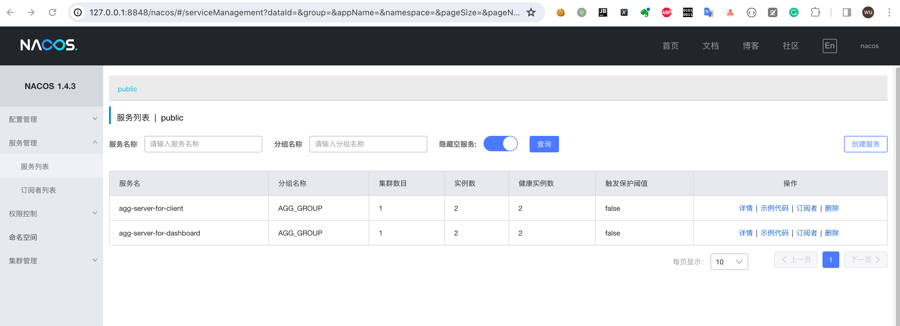
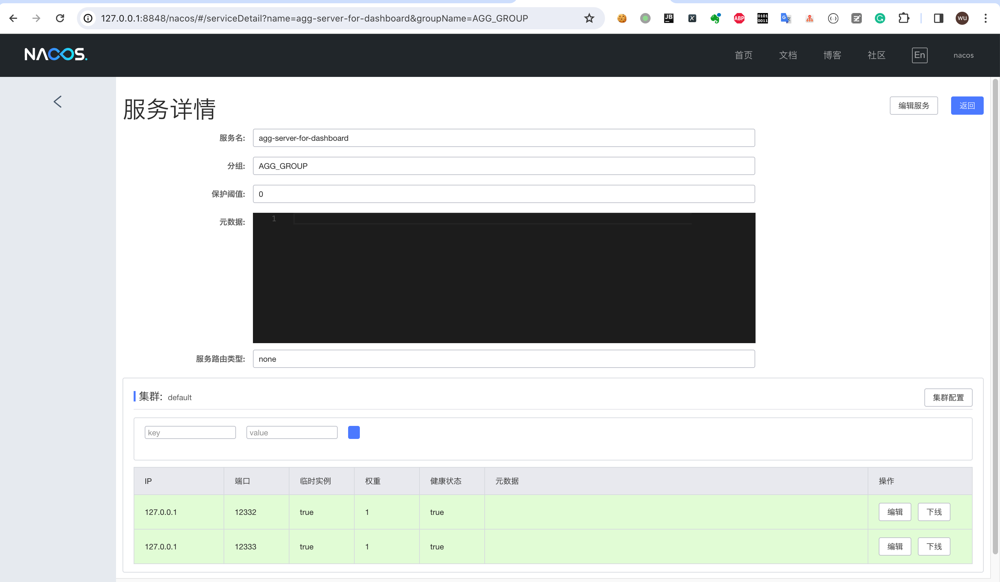

# server集群部署
适用于生产环境，需要保证高可用。  
注册中心推荐使用：nacos、zookeeper    
存储类型推荐使用： jdbc、 redis、shard-redis、redis-cluster   
任务部署方式推荐采用：quartz集群模式       

以下以注册中心[nacos]+存储类型[redis]+任务部署类型[quartz集群模式]这种组合为例。
## 准备阶段
**注意**: 对于agg-server、nacos、redis、mysql正常情况是需要独立实例部署的，这里考虑到机器资源有限，暂时部署在同一机器上。  
###  安装并启动nacos服务
地址为：127.0.0.1:8848
### 安装并启动redis服务
地址为：127.0.0.1:6379
###  安装并启动mysql服务
地址为：127.0.0.1:3306
### 初始化quartz数据库
这里使用mysql数据库，脚本请[查看](https://github.com/changmingxie/aggregate-framework/blob/master-4.x/aggregate-framework-server/src/main/dbscripts/db_init.sql)

### 下载最新[RELEASE](https://github.com/changmingxie/aggregate-framework/releases)版本
下载最新的安装包aggregate-framework-server-xxx.tar.gz

## 实例1安装并启动
### 第一步 创建server目录并解压
**创建server目录**
```shell script
makdir server 
cd  server  
```
**下载aggregate-framework-server-xxx.tar.gz**，解压到server目录  
```shell script
server % tar zxvf aggregate-framework-server-4.0.0-SNAPSHOT.tar.gz
x conf/application.yaml
x lib/aggregate-framework-server.jar
x conf/
x conf/logback.xml
x bin/
x bin/startup.sh
x bin/startup.cmd
x bin/shutdown.sh
x bin/shutdown.cmd
server % tree
.
├── aggregate-framework-server-4.0.0-SNAPSHOT.tar.gz
├── bin
│   ├── shutdown.cmd
│   ├── shutdown.sh
│   ├── startup.cmd
│   └── startup.sh
├── conf
│   ├── application.yaml
│   └── logback.xml
└── lib
    └── aggregate-framework-server.jar

3 directories, 8 files
server % 
```

### 第二步 修改application.yaml配置
[参数说明详见](/zh-cn/aggdocs/tutorial/configurations.html#server端)  
这里以注册中心[nacos]+存储类型[redis]+任务部署类型[quartz集群模式]为例，对应的application.yaml可如下
```yaml
server:
  port: 12332
  servlet:
    context-path: /${spring.application.name}

logging:
  level:
    root: info

spring:
  application:
    name: aggregate-framework-server
  autoconfigure:
    exclude:
      - org.springframework.boot.autoconfigure.jdbc.DataSourceAutoConfiguration
  agg:
    storage:
      storage-type: redis
      redis:
        host: 127.0.0.1
        port: 6379
        database: 0
        pool-config:
          max-total: 100
          max-idle: 100
          min-idle: 10
          max-wait-millis: 300
    recovery:
      quartz-clustered: true
      quartz-data-source-url: jdbc:mysql://localhost:3306/AGG_SERVER?useSSL=false&allowPublicKeyRetrieval=true
      quartz-data-source-driver: com.mysql.jdbc.Driver
      quartz-data-source-user: root
      quartz-data-source-password: 123456
      max-retry-count: 3
    registry:
      registry-address: 127.0.0.1:2332
      registry-address-for-dashboard: 127.0.0.1:12332
      registry-type: nacos
      cluster-name: default
      nacos:
        server-addr: 127.0.0.1:8848
    remoting:
      listen-port: 2332
```  

### 第三步 启动server
```shell script
sh bin/startup.sh #执行sh bin/shutdown.sh来停止服务
```

## 实例2安装并启动
参考**实例1安装并启动**
application.yaml可如下
```yaml
server:
  port: 12333
  servlet:
    context-path: /${spring.application.name}

logging:
  level:
    root: info

spring:
  application:
    name: aggregate-framework-server
  autoconfigure:
    exclude:
      - org.springframework.boot.autoconfigure.jdbc.DataSourceAutoConfiguration
  agg:
    storage:
      storage-type: redis
      redis:
        host: 127.0.0.1
        port: 6379
        database: 0
        pool-config:
          max-total: 100
          max-idle: 100
          min-idle: 10
          max-wait-millis: 300
    recovery:
      quartz-clustered: true
      quartz-data-source-url: jdbc:mysql://localhost:3306/AGG_SERVER?useSSL=false&allowPublicKeyRetrieval=true
      quartz-data-source-driver: com.mysql.jdbc.Driver
      quartz-data-source-user: root
      quartz-data-source-password: 123456
      max-retry-count: 3
    registry:
      registry-address: 127.0.0.1:2333
      registry-address-for-dashboard: 127.0.0.1:12333
      registry-type: nacos
      cluster-name: default
      nacos:
        server-addr: 127.0.0.1:8848
    remoting:
      listen-port: 2333
```

## 验证
实例1和实例2正常启动后，会在nacos显示如下信息。

**netty-server实例注册成功**，见下图

**web实例注册成功**，见下图


恭喜你，server集群模式搭建完成！
