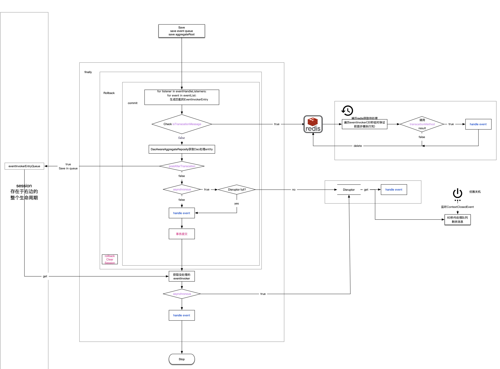

# 事件处理器
事件处理器采用观察者模式，监听聚合根上发布事件的，并执行相应逻辑。借助事件处理器可以实现：  
1. 聚合根间的依赖解耦。  
2. 分离核心流程和分支流程。  
3. 满足分布式场景下的数据一致性要求。  

可以通过在方法上添加[@EventHandler](/zh-cn/aggdocs/tutorial/api.html#%40EventHandler)来创建事件处理器。方法的入参有且仅有一个，是所需处理的事件类型（也可以是集合）。  

## 使用示例
```java
@Component
@Slf4j
public class AccountEventHandler {

    @Autowired
    private AccountRepository accountRepository;

    @EventHandler(asynchronous = true, postAfterTransaction = true, isTransactionMessage = true,
            asyncConfig = @AsyncConfig(queueFullPolicy = QueueFullPolicy.DISCARD),
            transactionCheck = @TransactionCheck(checkTransactionStatusMethod = "checkAccountCreateEvent"))
    @Transactional(rollbackFor = Throwable.class)
    public void handleAccountCreateEvent(AccountCreateEvent accountCreateEvent) {
        log.info("exec handleAccountCreateEvent，{}", accountCreateEvent);
        //业务逻辑
    }

    @EventHandler(asynchronous = true, postAfterTransaction = true, isTransactionMessage = true,
            asyncConfig = @AsyncConfig(queueFullPolicy = QueueFullPolicy.DISCARD),
            transactionCheck = @TransactionCheck(checkTransactionStatusMethod = "batchCheckAccountCreateEvent"))
    @Transactional(rollbackFor = Throwable.class)
    public void batchHandleAccountCreateEvent(List<AccountCreateEvent> accountCreateEvents) {
        log.info("exec batchHandleAccountCreateEvent，{}", accountCreateEvents);
        //业务逻辑
    }

    public boolean checkAccountCreateEvent(AccountCreateEvent accountCreateEvent) {
        return accountRepository.findByAccountId(accountCreateEvent.getAccountId()) != null;
    }

    public boolean batchCheckAccountCreateEvent(List<AccountCreateEvent> accountCreateEvents) {
        return !accountRepository.findByAccountIds(accountCreateEvents.stream().map(AccountCreateEvent::getAccountId).collect(Collectors.toList())).isEmpty();
    }
}
```
## 实现原理
