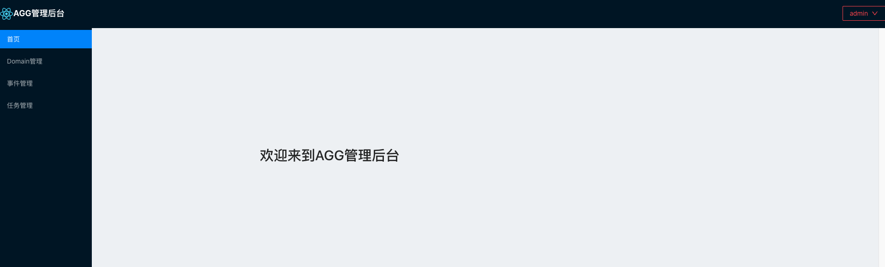
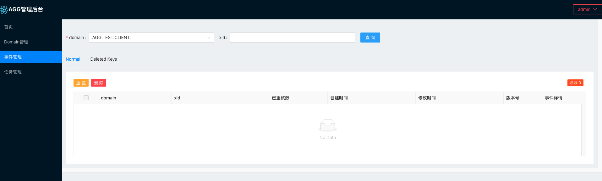
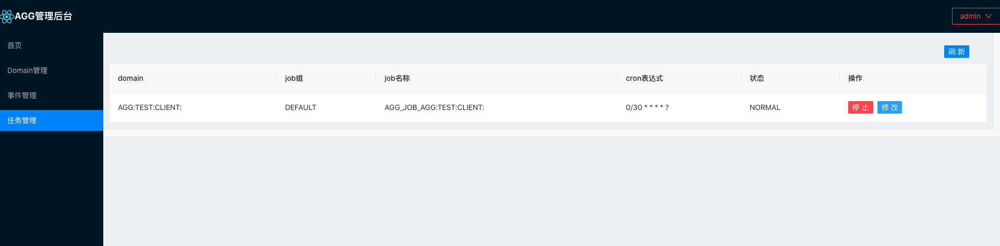
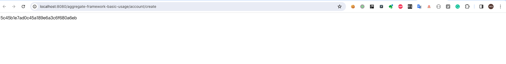
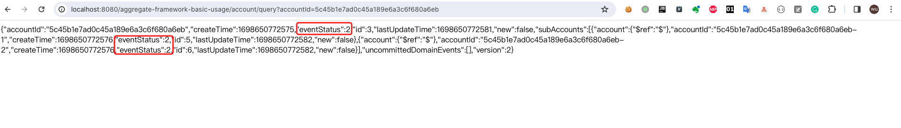
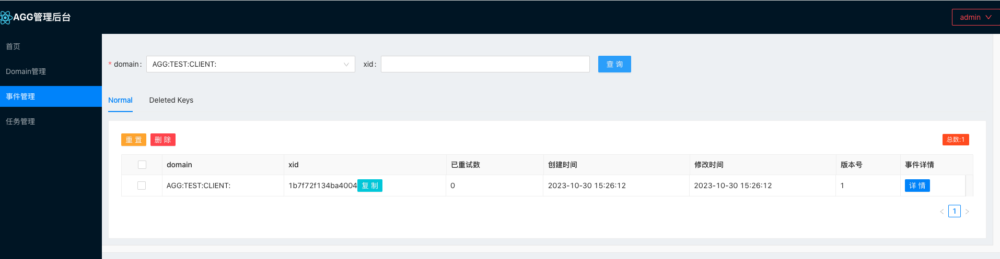
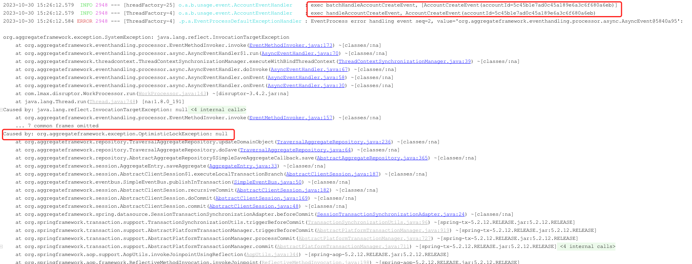
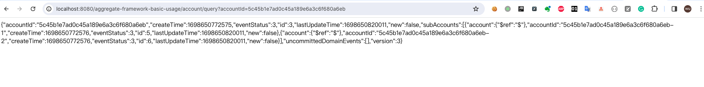
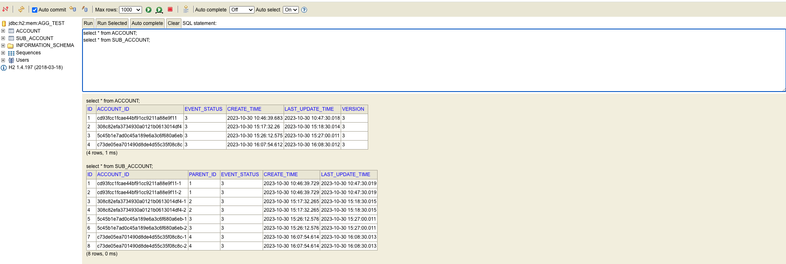

# 快速开始
让我们从一个简单的示例开始！

## 示例说明
在该示例中，我们将账户(Account)作为**聚合根**，子账户(SubAccount)作为**领域对象**，一个账户下可以存在若干个子账户。在为用户创建账户时，会借助**事件**来对账户进行初始化。

## 搭建步骤
1.新建一个springboot项目，添加maven依赖
```xml
<dependencies>
    <!--需要先在本地install aggregate-framework项目-->
    <dependency>
        <groupId>org.aggregateframework</groupId>
        <artifactId>aggregate-framework-spring-boot-starter</artifactId>
        <version>4.0.0-SNAPSHOT</version>
    </dependency>

    <dependency>
        <groupId>org.springframework.boot</groupId>
        <artifactId>spring-boot-starter-web</artifactId>
        <version>2.2.13.RELEASE</version>
    </dependency>
    
    <dependency>
        <groupId>org.mybatis.spring.boot</groupId>
        <artifactId>mybatis-spring-boot-starter</artifactId>
        <version>2.1.4</version>
    </dependency>
    
    <dependency>
        <groupId>com.h2database</groupId>
        <artifactId>h2</artifactId>
        <version>1.4.197</version>
    </dependency>

    <dependency>
        <groupId>org.springframework.boot</groupId>
        <artifactId>spring-boot-starter-aop</artifactId>
        <version>2.2.13.RELEASE</version>
    </dependency>

    <dependency>
        <groupId>com.google.guava</groupId>
        <artifactId>guava</artifactId>
        <version>19.0</version>
    </dependency>
    
    <dependency>
        <groupId>org.projectlombok</groupId>
        <artifactId>lombok</artifactId>
        <version>1.18.16</version>
    </dependency>
</dependencies>
```
2.以org.aggregateframework.basic.usage为根目录，在根目录下新建启动类  
BasicUsageApplication.java
```java
package org.aggregateframework.basic.usage;

import org.mybatis.spring.annotation.MapperScan;
import org.springframework.boot.SpringApplication;
import org.springframework.boot.autoconfigure.SpringBootApplication;

@SpringBootApplication
@MapperScan("org.aggregateframework.basic.usage.dao")
public class BasicUsageApplication {
    public static void main(String[] args) {
        SpringApplication.run(BasicUsageApplication.class, args);
    }
}
```

3.新建entity目录，创建Account和SubAccount对象  
Account.java
```java
package org.aggregateframework.basic.usage.entity;

import lombok.*;
import org.aggregateframework.basic.usage.event.AccountCreateEvent;
import org.aggregateframework.entity.AbstractSimpleAggregateRoot;
import org.aggregateframework.entity.DaoAwareQuery;

import java.util.ArrayList;
import java.util.List;

/**
 * Account类继承自AbstractSimpleAggregateRoot，代表它是一个聚合根。
 * 使用@DaoAwareQuery来表示在查找Account时，如何获取其关联的领域对象
 */
@Data
@EqualsAndHashCode(callSuper = true)
@Builder
@AllArgsConstructor
@NoArgsConstructor
public class Account extends AbstractSimpleAggregateRoot<Long> {

    private Long id;

    private String accountId;

    private Integer eventStatus;

    @DaoAwareQuery(mappedBy = "account", select = "findByParentId")
    private List<SubAccount> subAccounts = new ArrayList<>();

    public void applyAccountCreateEvent(){
        apply(new AccountCreateEvent(accountId));
    }
}

```
SubAccount.java
```java
package org.aggregateframework.basic.usage.entity;

import lombok.*;
import org.aggregateframework.entity.AbstractSimpleDomainObject;

/**
 * SubAccount类继承自AbstractSimpleAggregateRoot，代表它是一个领域对象。
 */
@Data
@EqualsAndHashCode(callSuper = true)
@Builder
@AllArgsConstructor
@NoArgsConstructor
public class SubAccount extends AbstractSimpleDomainObject<Long> {

    private Long id;

    private String accountId;

    private Account account;

    private Integer eventStatus;
}
```

4.添加仓储层代码  
新建dao目录，创建AccountDao和SubAccountDao对象  
AccountDao.class
```java
package org.aggregateframework.basic.usage.dao;

import org.aggregateframework.basic.usage.entity.Account;
import org.aggregateframework.dao.AggregateRootDao;
import org.apache.ibatis.annotations.Param;

import java.util.List;

public interface AccountDao extends AggregateRootDao<Account,Long> {

    Account findByAccountId(@Param("accountId") String accountId);

    List<Account> findByAccountIds(List<String> accountIds);
}
```
SubAccountDao.class
```java
package org.aggregateframework.basic.usage.dao;

import org.aggregateframework.basic.usage.entity.SubAccount;
import org.aggregateframework.dao.DomainObjectDao;
import org.apache.ibatis.annotations.Param;

import java.util.List;

public interface SubAccountDao extends DomainObjectDao<SubAccount,Long> {

    List<SubAccount> findByParentId(@Param("parentId") Long parentId);
}
```
在resources目录下新建mapping目录，添加对应的XML文件  
AccountMapper.xml
```xml
<?xml version="1.0" encoding="UTF-8" ?>
<!DOCTYPE mapper PUBLIC "-//mybatis.org//DTD Mapper 3.0//EN" "http://mybatis.org/dtd/mybatis-3-mapper.dtd" >
<mapper namespace="org.aggregateframework.basic.usage.dao.AccountDao" >
    
    <resultMap id="baseResultMap" type="org.aggregateframework.basic.usage.entity.Account">
        <result property="id" column="ID"/>
        <result property="accountId" column="ACCOUNT_ID"/>
        <result property="eventStatus" column="EVENT_STATUS"/>
        <result property="createTime" column="CREATE_TIME"/>
        <result property="lastUpdateTime" column="LAST_UPDATE_TIME"/>
        <result property="version" column="VERSION"/>
    </resultMap>

    <sql id="sql_select">
        SELECT ID,
               ACCOUNT_ID,
               EVENT_STATUS,
               VERSION,
               CREATE_TIME,
               LAST_UPDATE_TIME
        FROM ACCOUNT
    </sql>

    <select id="findAll" resultMap="baseResultMap">
        <include refid="sql_select"/>
    </select>

    <select id="findById" resultMap="baseResultMap">
        <include refid="sql_select"/>
		WHERE ID=#{id}
    </select>

    <select id="findByAccountId" resultMap="baseResultMap">
        <include refid="sql_select"/>
        WHERE ACCOUNT_ID=#{accountId}
    </select>

    <select id="findByAccountIds" resultMap="baseResultMap">
        <include refid="sql_select"/>
        WHERE ACCOUNT_ID in 
        <foreach item="item" index="index" collection="list" separator="," open="(" close=")">
            #{item}
        </foreach>
    </select>

    <insert id="insert" useGeneratedKeys="true" keyProperty="id" keyColumn="ID" parameterType="org.aggregateframework.basic.usage.entity.Account">
        INSERT INTO ACCOUNT
            (ACCOUNT_ID,EVENT_STATUS,VERSION,CREATE_TIME,LAST_UPDATE_TIME)
        VALUES
            (#{accountId},#{eventStatus},#{version},#{createTime},#{lastUpdateTime})
    </insert>

    <update id="update" parameterType="org.aggregateframework.basic.usage.entity.Account">
        UPDATE
        `ACCOUNT`
        SET
        ACCOUNT_ID=#{accountId},
        EVENT_STATUS=#{eventStatus},
        VERSION=#{version},
        LAST_UPDATE_TIME=#{lastUpdateTime}
        WHERE ID=#{id}
        AND VERSION=#{version}-1
    </update>

    <delete id="delete">
        DELETE FROM ACCOUNT WHERE ID=#{id}
    </delete>
</mapper>
```
SubAccountMapper.xml
```xml
<?xml version="1.0" encoding="UTF-8" ?>
<!DOCTYPE mapper PUBLIC "-//mybatis.org//DTD Mapper 3.0//EN" "http://mybatis.org/dtd/mybatis-3-mapper.dtd" >
<mapper namespace="org.aggregateframework.basic.usage.dao.SubAccountDao" >
    <resultMap id="baseResultMap" type="org.aggregateframework.basic.usage.entity.SubAccount">
        <result property="id" column="ID"/>
        <result property="accountId" column="ACCOUNT_ID"/>
        <result property="account.id" column="PARENT_ID"/>
        <result property="eventStatus" column="EVENT_STATUS"/>
        <result property="createTime" column="CREATE_TIME"/>
        <result property="lastUpdateTime" column="LAST_UPDATE_TIME"/>
    </resultMap>

    <sql id="sql_select">
        SELECT ID,
               ACCOUNT_ID,
               PARENT_ID,
               EVENT_STATUS,
               CREATE_TIME,
               LAST_UPDATE_TIME
        FROM SUB_ACCOUNT
    </sql>

    <select id="findById" resultMap="baseResultMap">
        <include refid="sql_select"/>
        WHERE ID=#{id}
    </select>

    <select id="findByParentId" resultMap="baseResultMap">
        <include refid="sql_select"/>
        WHERE PARENT_ID = #{parentId}
    </select>

    <insert id="insert" useGeneratedKeys="true" keyProperty="id" keyColumn="ID" parameterType="org.aggregateframework.basic.usage.entity.SubAccount">
        INSERT INTO SUB_ACCOUNT
            (ACCOUNT_ID,PARENT_ID,EVENT_STATUS,CREATE_TIME,LAST_UPDATE_TIME)
        VALUES
        (#{accountId},#{account.id},#{eventStatus},#{createTime},#{lastUpdateTime})
    </insert>

    <update id="update" parameterType="org.aggregateframework.basic.usage.entity.SubAccount">
        UPDATE
            `SUB_ACCOUNT`
        SET
            ACCOUNT_ID=#{accountId},
            PARENT_ID=#{account.id},
            EVENT_STATUS=#{eventStatus},
            LAST_UPDATE_TIME=#{lastUpdateTime}
        WHERE ID=#{id}
    </update>


    <delete id="delete">
        DELETE FROM
            SUB_ACCOUNT WHERE ID=#{id}
    </delete>
</mapper>
```

新建repository目录，为聚合根添加Repository  
AccountRepository.class
```java
package org.aggregateframework.basic.usage.repository;


import org.aggregateframework.basic.usage.dao.AccountDao;
import org.aggregateframework.basic.usage.entity.Account;
import org.aggregateframework.repository.DaoAwareAggregateRepository;
import org.springframework.beans.factory.annotation.Autowired;
import org.springframework.stereotype.Repository;

import java.util.List;

@Repository
public class AccountRepository extends DaoAwareAggregateRepository<Account,Long> {

    @Autowired
    private AccountDao accountDao;

    public AccountRepository() {
        super(Account.class);
    }

    public Account findByAccountId(String accountId) {
        return fetchAllComponents(accountDao.findByAccountId(accountId));
    }

    public List<Account> findByAccountIds(List<String> accountIds) {
        return fetchAllComponents(accountDao.findByAccountIds(accountIds));
    }
}

```

5.新建event目录，添加事件和事件处理器
AccountCreateEvent.class
```java
package org.aggregateframework.basic.usage.event;

import lombok.AllArgsConstructor;
import lombok.Data;
import lombok.NoArgsConstructor;

@Data
@NoArgsConstructor
@AllArgsConstructor
public class AccountCreateEvent {

    private String accountId;
}
```
AccountEventHandler.class
```java
package org.aggregateframework.basic.usage.event;

import lombok.extern.slf4j.Slf4j;
import org.aggregateframework.basic.usage.entity.Account;
import org.aggregateframework.basic.usage.repository.AccountRepository;
import org.aggregateframework.eventhandling.annotation.AsyncConfig;
import org.aggregateframework.eventhandling.annotation.EventHandler;
import org.aggregateframework.eventhandling.annotation.QueueFullPolicy;
import org.aggregateframework.eventhandling.annotation.TransactionCheck;
import org.springframework.beans.factory.annotation.Autowired;
import org.springframework.stereotype.Component;
import org.springframework.transaction.annotation.Transactional;

import java.util.List;
import java.util.stream.Collectors;

/**
 * 使用@EventHandler创建事件处理器，此处通过修改账户的状态位来模拟对账户的初始化操作。
 */
@Component
@Slf4j
public class AccountEventHandler {

    @Autowired
    private AccountRepository accountRepository;

    private static final Integer AGG_EVENT_STATUS_POS_1 = 1 << 0;

    private static final Integer AGG_EVENT_STATUS_POS_2 = 1 << 1;

    @EventHandler(asynchronous = true, postAfterTransaction = true, isTransactionMessage = true,
            asyncConfig = @AsyncConfig(queueFullPolicy = QueueFullPolicy.DISCARD),
            transactionCheck = @TransactionCheck(checkTransactionStatusMethod = "checkAccountCreateEvent"))
    @Transactional(rollbackFor = Throwable.class)
    public void handleAccountCreateEvent(AccountCreateEvent accountCreateEvent) {
        log.info("exec handleAccountCreateEvent，{}", accountCreateEvent);
        Account account = accountRepository.findByAccountId(accountCreateEvent.getAccountId());
        if (account != null) {
            account.setEventStatus(account.getEventStatus() | AGG_EVENT_STATUS_POS_1);
            account.getSubAccounts().forEach(each -> each.setEventStatus(each.getEventStatus() | AGG_EVENT_STATUS_POS_1));
        }
        accountRepository.save(account);
    }

    @EventHandler(asynchronous = true, postAfterTransaction = true, isTransactionMessage = true,
            asyncConfig = @AsyncConfig(queueFullPolicy = QueueFullPolicy.DISCARD),
            transactionCheck = @TransactionCheck(checkTransactionStatusMethod = "batchCheckAccountCreateEvent"))
    @Transactional(rollbackFor = Throwable.class)
    public void batchHandleAccountCreateEvent(List<AccountCreateEvent> accountCreateEvents) {
        log.info("exec batchHandleAccountCreateEvent，{}", accountCreateEvents);
        List<Account> accounts = accountRepository.findByAccountIds(accountCreateEvents.stream().map(AccountCreateEvent::getAccountId).collect(Collectors.toList()));
        accounts.forEach(account -> {
            account.setEventStatus(account.getEventStatus() | AGG_EVENT_STATUS_POS_2);
            account.getSubAccounts().forEach(each -> each.setEventStatus(each.getEventStatus() | AGG_EVENT_STATUS_POS_2));
        });
        accountRepository.save(accounts);
    }

    public boolean checkAccountCreateEvent(AccountCreateEvent accountCreateEvent) {
        return accountRepository.findByAccountId(accountCreateEvent.getAccountId()) != null;
    }

    public boolean batchCheckAccountCreateEvent(List<AccountCreateEvent> accountCreateEvents) {
        return !accountRepository.findByAccountIds(accountCreateEvents.stream().map(AccountCreateEvent::getAccountId).collect(Collectors.toList())).isEmpty();
    }
}
```

6.新建controller目录，添加供外部创建账户的api  
AccountController.class
```java
package org.aggregateframework.basic.usage.controller;

import com.alibaba.fastjson.JSON;
import lombok.extern.slf4j.Slf4j;
import org.aggregateframework.basic.usage.entity.Account;
import org.aggregateframework.basic.usage.entity.SubAccount;
import org.aggregateframework.basic.usage.repository.AccountRepository;
import org.springframework.beans.factory.annotation.Autowired;
import org.springframework.web.bind.annotation.GetMapping;
import org.springframework.web.bind.annotation.RequestMapping;
import org.springframework.web.bind.annotation.RequestParam;
import org.springframework.web.bind.annotation.RestController;

import java.util.List;
import java.util.UUID;
import java.util.stream.Collectors;
import java.util.stream.IntStream;

@Slf4j
@RestController
@RequestMapping("/account")
public class AccountController {

    @Autowired
    private AccountRepository accountRepository;

    @GetMapping("/create")
    public String create(@RequestParam(defaultValue = "1") Integer amount) {
        String accountId = UUID.randomUUID().toString().replace("-", "");
        Account account = Account.builder()
                .accountId(accountId)
                .eventStatus(0)
                .build();
        List<SubAccount> subAccounts = IntStream.range(1, 3).mapToObj(each -> SubAccount.builder()
                .accountId(accountId + "-" + each)
                .account(account)
                .eventStatus(0)
                .build()).collect(Collectors.toList());
        account.setSubAccounts(subAccounts);
        account.applyAccountCreateEvent();
        accountRepository.save(account);
        return accountId;
    }

    @GetMapping("/query")
    public String query(@RequestParam("accountId") String accountId){
        return JSON.toJSONString(accountRepository.findByAccountId(accountId));
    }
}
```

7.部署配置  
在resources目录下，添加项目配置文件  
application.yaml  
```yaml
server:
  port: 8080
  servlet:
    context-path: /${spring.application.name}
spring:
  application:
    name: aggregate-framework-basic-usage
  profiles:
    active: local  # Possible values: local, server
  #使用h2数据库，存储业务数据
  datasource:
    driver-class-name: org.h2.Driver
    url: jdbc:h2:mem:AGG_TEST
    username: root
    password: welcome1
    initialization-mode: always
    schema: classpath:schema.sql
  #h2数据库控台地址 http://localhost:8080/aggregate-framework-basic-usage/h2-console
  h2:
    console:
      enabled: true
      settings:
        web-allow-others: true
mybatis:
  mapper-locations: classpath:mapping/*.xml

logging:
  level:
    root: info
```
application-local.yaml
```yaml
#embedded模式额外配置
spring:
  agg:
    storage:
      storage-type: redis
      domain: "AGG:TEST:CLIENT:"
      serializer-type: kryo
      redis:
        host: 127.0.0.1
        port: 6379
        database: 0
        pool-config:
          max-total: 100
          max-idle: 100
          min-idle: 10
          max-wait-millis: 300
    recovery:
      recovery-enabled: true
      update-job-forcibly: false
      quartz-clustered: false
      recover-duration: 30
      max-retry-count: 3
      fetch-page-size: 200
      cron-expression: "0/30 * * * * ? "
```
application-server.yaml
```yaml
#server模式额外配置
spring:
  agg:
    storage:
      storage-type: remoting
      domain: "AGG:TEST:CLIENT:"
      serializer-type: kryo
      request-timeout-millis: 10000
    registry:
      cluster-name: default
      registry-type: direct
      direct:
        addresses-for-client: 127.0.0.1:2332


```
在resources目录下，添加h2数据库初始化脚本
schema.sql
```sql
DROP TABLE IF EXISTS `ACCOUNT`;
CREATE TABLE `ACCOUNT`
(
    `ID` bigint(20) NOT NULL AUTO_INCREMENT,
    `ACCOUNT_ID` varchar(40) NOT NULL COMMENT '账户id',
    `EVENT_STATUS` bigint(20) NOT NULL DEFAULT 0 COMMENT '状态(测试agg事件)',
    `CREATE_TIME` datetime DEFAULT CURRENT_TIMESTAMP COMMENT '创建时间',
    `LAST_UPDATE_TIME` datetime DEFAULT CURRENT_TIMESTAMP COMMENT '最近更新时间',
    `VERSION` int(11) DEFAULT '1' COMMENT '版本号',
    PRIMARY KEY (`ID`)
);

CREATE UNIQUE INDEX ON ACCOUNT(ACCOUNT_ID);

DROP TABLE IF EXISTS `SUB_ACCOUNT`;
CREATE TABLE `SUB_ACCOUNT`
(
    `ID` bigint(20) NOT NULL AUTO_INCREMENT,
    `ACCOUNT_ID` varchar(40) NOT NULL COMMENT '子账户id',
    `PARENT_ID` varchar(40) NOT NULL COMMENT '主账户主键',
    `EVENT_STATUS` bigint(20) NOT NULL DEFAULT 0 COMMENT '状态(测试agg事件)',
    `CREATE_TIME` datetime DEFAULT CURRENT_TIMESTAMP COMMENT '创建时间',
    `LAST_UPDATE_TIME` datetime DEFAULT CURRENT_TIMESTAMP COMMENT '最近更新时间',
    PRIMARY KEY (`ID`)
);

CREATE UNIQUE INDEX ON SUB_ACCOUNT(ACCOUNT_ID);
CREATE INDEX ON SUB_ACCOUNT(PARENT_ID);
```
7.1 使用embedded模式  
将application.yaml中的spring.profiles.active设为local  
修改**aggregate-framework-dashboard模块**resource目录下的配置文件  
application.yaml
```yaml
server:
  servlet:
    context-path: /aggregate-framework-dashboard
  port: 22332

logging:
  level:
    root: info
spring:
  application:
    name: aggregate-framework-dashboard
  resources:
    static-locations: classpath:templates/
    chain:
      cache: false
  freemarker:
    enabled: true
    cache: false
    charset: UTF-8
    suffix: .html
    check-template-location: true
    template-loader-path: classpath:/templates/
  agg:
    dashboard:
      userName: admin
      password: 123456
      connection-mode: embedded
    registry:
      registry-role: dashboard
    storage:
      storage-type: redis
      redis:
        host: 127.0.0.1
        port: 6379
        database: 0
        pool-config:
          max-total: 100
          max-idle: 100
          min-idle: 10
          max-wait-millis: 300
    
```

7.2 使用server模式  
将application.yaml中的spring.profiles.active设为server  
修改**aggregate-framework-dashboard模块**resource目录下的配置文件  
application.yaml
```yaml
# dashbaord aggserver模式专项配置
server:
  servlet:
    context-path: /aggregate-framework-dashboard
  port: 22332

logging:
  level:
    root: info
spring:
  application:
    name: aggregate-framework-dashboard
  resources:
    static-locations: classpath:templates/
    chain:
      cache: false
  freemarker:
    enabled: true
    cache: false
    charset: UTF-8
    suffix: .html
    check-template-location: true
    template-loader-path: classpath:/templates/
  agg:
    dashboard:
      userName: admin
      password: 123456
      connection-mode: server
    registry:
      registry-type: direct
      registry-role: dashboard
      direct:
        addresses-for-dashboard: localhost:12332
feign:
  path: /aggregate-framework-server
```
修改**aggregate-framework-server模块**resource目录下的配置文件  
application.yaml
```yaml
server:
  port: 12332
  servlet:
    context-path: /${spring.application.name}

logging:
  level:
    root: info

spring:
  application:
    name: aggregate-framework-server
  autoconfigure:
    exclude:
    - org.springframework.boot.autoconfigure.jdbc.DataSourceAutoConfiguration
  agg:
    storage:
      storage-type: redis
      jdbc:
        password: 123456
      redis:
        host: 127.0.0.1
        port: 6379
        database: 0
        pool-config:
          max-total: 100
          max-idle: 100
          min-idle: 10
          max-wait-millis: 300
    recovery:
      quartz-clustered: true
      quartz-data-source-url: jdbc:mysql://localhost:3306/AGG_SERVER?useSSL=false&allowPublicKeyRetrieval=true
      quartz-data-source-driver: com.mysql.jdbc.Driver
      quartz-data-source-user: root
      quartz-data-source-password: 123456
      max-retry-count: 3
    registry:
      registry-type: direct
      cluster-name: default
    remoting:
      listen-port: 2332
```

## 功能演示
至此，准备工作已就绪，在示例中采用了redis来保存事务日志，因此需要在本地启动redis服务。此外，若采用server模式还需要在本地启动mysql服务，并执行以下脚本，用于[quartz框架](https://github.com/quartz-scheduler/quartz)
```sql
CREATE DATABASE IF NOT EXISTS `AGG_SERVER` CHARACTER SET 'utf8mb4' COLLATE 'utf8mb4_unicode_ci';

USE `AGG_SERVER`;

DROP TABLE IF EXISTS QRTZ_FIRED_TRIGGERS;
DROP TABLE IF EXISTS QRTZ_PAUSED_TRIGGER_GRPS;
DROP TABLE IF EXISTS QRTZ_SCHEDULER_STATE;
DROP TABLE IF EXISTS QRTZ_LOCKS;
DROP TABLE IF EXISTS QRTZ_SIMPLE_TRIGGERS;
DROP TABLE IF EXISTS QRTZ_SIMPROP_TRIGGERS;
DROP TABLE IF EXISTS QRTZ_CRON_TRIGGERS;
DROP TABLE IF EXISTS QRTZ_BLOB_TRIGGERS;
DROP TABLE IF EXISTS QRTZ_TRIGGERS;
DROP TABLE IF EXISTS QRTZ_JOB_DETAILS;
DROP TABLE IF EXISTS QRTZ_CALENDARS;

CREATE TABLE QRTZ_JOB_DETAILS
(
    SCHED_NAME        VARCHAR(120) NOT NULL,
    JOB_NAME          VARCHAR(190) NOT NULL,
    JOB_GROUP         VARCHAR(190) NOT NULL,
    DESCRIPTION       VARCHAR(250) NULL,
    JOB_CLASS_NAME    VARCHAR(250) NOT NULL,
    IS_DURABLE        VARCHAR(1)   NOT NULL,
    IS_NONCONCURRENT  VARCHAR(1)   NOT NULL,
    IS_UPDATE_DATA    VARCHAR(1)   NOT NULL,
    REQUESTS_RECOVERY VARCHAR(1)   NOT NULL,
    JOB_DATA          BLOB NULL,
    PRIMARY KEY (SCHED_NAME, JOB_NAME, JOB_GROUP)
) ENGINE=InnoDB;

CREATE TABLE QRTZ_TRIGGERS
(
    SCHED_NAME     VARCHAR(120) NOT NULL,
    TRIGGER_NAME   VARCHAR(190) NOT NULL,
    TRIGGER_GROUP  VARCHAR(190) NOT NULL,
    JOB_NAME       VARCHAR(190) NOT NULL,
    JOB_GROUP      VARCHAR(190) NOT NULL,
    DESCRIPTION    VARCHAR(250) NULL,
    NEXT_FIRE_TIME BIGINT(13) NULL,
    PREV_FIRE_TIME BIGINT(13) NULL,
    PRIORITY       INTEGER NULL,
    TRIGGER_STATE  VARCHAR(16)  NOT NULL,
    TRIGGER_TYPE   VARCHAR(8)   NOT NULL,
    START_TIME     BIGINT(13) NOT NULL,
    END_TIME       BIGINT(13) NULL,
    CALENDAR_NAME  VARCHAR(190) NULL,
    MISFIRE_INSTR  SMALLINT(2) NULL,
    JOB_DATA       BLOB NULL,
    PRIMARY KEY (SCHED_NAME, TRIGGER_NAME, TRIGGER_GROUP),
    FOREIGN KEY (SCHED_NAME, JOB_NAME, JOB_GROUP)
        REFERENCES QRTZ_JOB_DETAILS (SCHED_NAME, JOB_NAME, JOB_GROUP)
) ENGINE=InnoDB;

CREATE TABLE QRTZ_SIMPLE_TRIGGERS
(
    SCHED_NAME      VARCHAR(120) NOT NULL,
    TRIGGER_NAME    VARCHAR(190) NOT NULL,
    TRIGGER_GROUP   VARCHAR(190) NOT NULL,
    REPEAT_COUNT    BIGINT(7) NOT NULL,
    REPEAT_INTERVAL BIGINT(12) NOT NULL,
    TIMES_TRIGGERED BIGINT(10) NOT NULL,
    PRIMARY KEY (SCHED_NAME, TRIGGER_NAME, TRIGGER_GROUP),
    FOREIGN KEY (SCHED_NAME, TRIGGER_NAME, TRIGGER_GROUP)
        REFERENCES QRTZ_TRIGGERS (SCHED_NAME, TRIGGER_NAME, TRIGGER_GROUP)
) ENGINE=InnoDB;

CREATE TABLE QRTZ_CRON_TRIGGERS
(
    SCHED_NAME      VARCHAR(120) NOT NULL,
    TRIGGER_NAME    VARCHAR(190) NOT NULL,
    TRIGGER_GROUP   VARCHAR(190) NOT NULL,
    CRON_EXPRESSION VARCHAR(120) NOT NULL,
    TIME_ZONE_ID    VARCHAR(80),
    PRIMARY KEY (SCHED_NAME, TRIGGER_NAME, TRIGGER_GROUP),
    FOREIGN KEY (SCHED_NAME, TRIGGER_NAME, TRIGGER_GROUP)
        REFERENCES QRTZ_TRIGGERS (SCHED_NAME, TRIGGER_NAME, TRIGGER_GROUP)
) ENGINE=InnoDB;

CREATE TABLE QRTZ_SIMPROP_TRIGGERS
(
    SCHED_NAME    VARCHAR(120) NOT NULL,
    TRIGGER_NAME  VARCHAR(190) NOT NULL,
    TRIGGER_GROUP VARCHAR(190) NOT NULL,
    STR_PROP_1    VARCHAR(512) NULL,
    STR_PROP_2    VARCHAR(512) NULL,
    STR_PROP_3    VARCHAR(512) NULL,
    INT_PROP_1    INT NULL,
    INT_PROP_2    INT NULL,
    LONG_PROP_1   BIGINT NULL,
    LONG_PROP_2   BIGINT NULL,
    DEC_PROP_1    NUMERIC(13, 4) NULL,
    DEC_PROP_2    NUMERIC(13, 4) NULL,
    BOOL_PROP_1   VARCHAR(1) NULL,
    BOOL_PROP_2   VARCHAR(1) NULL,
    PRIMARY KEY (SCHED_NAME, TRIGGER_NAME, TRIGGER_GROUP),
    FOREIGN KEY (SCHED_NAME, TRIGGER_NAME, TRIGGER_GROUP)
        REFERENCES QRTZ_TRIGGERS (SCHED_NAME, TRIGGER_NAME, TRIGGER_GROUP)
) ENGINE=InnoDB;

CREATE TABLE QRTZ_BLOB_TRIGGERS
(
    SCHED_NAME    VARCHAR(120) NOT NULL,
    TRIGGER_NAME  VARCHAR(190) NOT NULL,
    TRIGGER_GROUP VARCHAR(190) NOT NULL,
    BLOB_DATA     BLOB NULL,
    PRIMARY KEY (SCHED_NAME, TRIGGER_NAME, TRIGGER_GROUP),
    INDEX (SCHED_NAME, TRIGGER_NAME, TRIGGER_GROUP),
    FOREIGN KEY (SCHED_NAME, TRIGGER_NAME, TRIGGER_GROUP)
        REFERENCES QRTZ_TRIGGERS (SCHED_NAME, TRIGGER_NAME, TRIGGER_GROUP)
) ENGINE=InnoDB;

CREATE TABLE QRTZ_CALENDARS
(
    SCHED_NAME    VARCHAR(120) NOT NULL,
    CALENDAR_NAME VARCHAR(190) NOT NULL,
    CALENDAR      BLOB         NOT NULL,
    PRIMARY KEY (SCHED_NAME, CALENDAR_NAME)
) ENGINE=InnoDB;

CREATE TABLE QRTZ_PAUSED_TRIGGER_GRPS
(
    SCHED_NAME    VARCHAR(120) NOT NULL,
    TRIGGER_GROUP VARCHAR(190) NOT NULL,
    PRIMARY KEY (SCHED_NAME, TRIGGER_GROUP)
) ENGINE=InnoDB;

CREATE TABLE QRTZ_FIRED_TRIGGERS
(
    SCHED_NAME        VARCHAR(120) NOT NULL,
    ENTRY_ID          VARCHAR(95)  NOT NULL,
    TRIGGER_NAME      VARCHAR(190) NOT NULL,
    TRIGGER_GROUP     VARCHAR(190) NOT NULL,
    INSTANCE_NAME     VARCHAR(190) NOT NULL,
    FIRED_TIME        BIGINT(13) NOT NULL,
    SCHED_TIME        BIGINT(13) NOT NULL,
    PRIORITY          INTEGER      NOT NULL,
    STATE             VARCHAR(16)  NOT NULL,
    JOB_NAME          VARCHAR(190) NULL,
    JOB_GROUP         VARCHAR(190) NULL,
    IS_NONCONCURRENT  VARCHAR(1) NULL,
    REQUESTS_RECOVERY VARCHAR(1) NULL,
    PRIMARY KEY (SCHED_NAME, ENTRY_ID)
) ENGINE=InnoDB;

CREATE TABLE QRTZ_SCHEDULER_STATE
(
    SCHED_NAME        VARCHAR(120) NOT NULL,
    INSTANCE_NAME     VARCHAR(190) NOT NULL,
    LAST_CHECKIN_TIME BIGINT(13) NOT NULL,
    CHECKIN_INTERVAL  BIGINT(13) NOT NULL,
    PRIMARY KEY (SCHED_NAME, INSTANCE_NAME)
) ENGINE=InnoDB;

CREATE TABLE QRTZ_LOCKS
(
    SCHED_NAME VARCHAR(120) NOT NULL,
    LOCK_NAME  VARCHAR(40)  NOT NULL,
    PRIMARY KEY (SCHED_NAME, LOCK_NAME)
) ENGINE=InnoDB;

CREATE INDEX IDX_QRTZ_J_REQ_RECOVERY ON QRTZ_JOB_DETAILS (SCHED_NAME, REQUESTS_RECOVERY);
CREATE INDEX IDX_QRTZ_J_GRP ON QRTZ_JOB_DETAILS (SCHED_NAME, JOB_GROUP);

CREATE INDEX IDX_QRTZ_T_J ON QRTZ_TRIGGERS (SCHED_NAME, JOB_NAME, JOB_GROUP);
CREATE INDEX IDX_QRTZ_T_JG ON QRTZ_TRIGGERS (SCHED_NAME, JOB_GROUP);
CREATE INDEX IDX_QRTZ_T_C ON QRTZ_TRIGGERS (SCHED_NAME, CALENDAR_NAME);
CREATE INDEX IDX_QRTZ_T_G ON QRTZ_TRIGGERS (SCHED_NAME, TRIGGER_GROUP);
CREATE INDEX IDX_QRTZ_T_STATE ON QRTZ_TRIGGERS (SCHED_NAME, TRIGGER_STATE);
CREATE INDEX IDX_QRTZ_T_N_STATE ON QRTZ_TRIGGERS (SCHED_NAME, TRIGGER_NAME, TRIGGER_GROUP, TRIGGER_STATE);
CREATE INDEX IDX_QRTZ_T_N_G_STATE ON QRTZ_TRIGGERS (SCHED_NAME, TRIGGER_GROUP, TRIGGER_STATE);
CREATE INDEX IDX_QRTZ_T_NEXT_FIRE_TIME ON QRTZ_TRIGGERS (SCHED_NAME, NEXT_FIRE_TIME);
CREATE INDEX IDX_QRTZ_T_NFT_ST ON QRTZ_TRIGGERS (SCHED_NAME, TRIGGER_STATE, NEXT_FIRE_TIME);
CREATE INDEX IDX_QRTZ_T_NFT_MISFIRE ON QRTZ_TRIGGERS (SCHED_NAME, MISFIRE_INSTR, NEXT_FIRE_TIME);
CREATE INDEX IDX_QRTZ_T_NFT_ST_MISFIRE ON QRTZ_TRIGGERS (SCHED_NAME, MISFIRE_INSTR, NEXT_FIRE_TIME, TRIGGER_STATE);
CREATE INDEX IDX_QRTZ_T_NFT_ST_MISFIRE_GRP ON QRTZ_TRIGGERS (SCHED_NAME, MISFIRE_INSTR, NEXT_FIRE_TIME, TRIGGER_GROUP,
                                                             TRIGGER_STATE);

CREATE INDEX IDX_QRTZ_FT_TRIG_INST_NAME ON QRTZ_FIRED_TRIGGERS (SCHED_NAME, INSTANCE_NAME);
CREATE INDEX IDX_QRTZ_FT_INST_JOB_REQ_RCVRY ON QRTZ_FIRED_TRIGGERS (SCHED_NAME, INSTANCE_NAME, REQUESTS_RECOVERY);
CREATE INDEX IDX_QRTZ_FT_J_G ON QRTZ_FIRED_TRIGGERS (SCHED_NAME, JOB_NAME, JOB_GROUP);
CREATE INDEX IDX_QRTZ_FT_JG ON QRTZ_FIRED_TRIGGERS (SCHED_NAME, JOB_GROUP);
CREATE INDEX IDX_QRTZ_FT_T_G ON QRTZ_FIRED_TRIGGERS (SCHED_NAME, TRIGGER_NAME, TRIGGER_GROUP);
CREATE INDEX IDX_QRTZ_FT_TG ON QRTZ_FIRED_TRIGGERS (SCHED_NAME, TRIGGER_GROUP);

commit;
```
接下来可依次运行server服务(如若需要)、dashboard服务和示例项目。server服务和dashboard服务可以通过下载[AGG源码](https://github.com/changmingxie/aggregate-framework)编译运行。也可直接在本地部署相应jar包，详见[server部署](/zh-cn/aggdocs/ops/server/index.html)和[dashboard部署](/zh-cn/aggdocs/ops/dashboard/index.html)。  
项目正常运行后，可通过访问[http://localhost:22332/aggregate-framework-dashboard](http://localhost:22332/aggregate-framework-dashboard)，进入管理后台。用户名密码分别为admin和123456。  

在Domain管理一栏中可以看到示例项目的domain信息，配置事件堆积处理、告警策略。

在事件管理一栏中可以，选中当前domain，即可处理该domain下堆积的事件，显然此时并没有。

在任务管理一栏中可以，可以启停或调整事件恢复任务的执行频率，需要注意的是该功能目前只支持**server模式**。

有关管理后台的详细介绍，可查看[dashboard使用手册](/zh-cn/aggdocs/ops/dashboard/dashboard-guild.html)。  
<br/>
尝试调用创建账户的api&nbsp;[http://localhost:8080/aggregate-framework-basic-usage/account/create](http://localhost:8080/aggregate-framework-basic-usage/account/create)，页面的返回值为accountId。  

然后立刻调用账户查询的api[http://localhost:8080/aggregate-framework-basic-usage/account/query?accountId=***](http://localhost:8080/aggregate-framework-basic-usage/account/query?accountId=***)(使用先前返回的accountId来替换***)，页面的返回值即为先前创建的账户信息。账户信息的状态有一定概率不为3。  

查询管理后台事件管理一栏，可以观察到发生了事件堆积，且项目日志中打印了乐观锁异常。这是由于示例项目中故意使用了两个事件处理器来同时修改账户的状态，从而造成了并发冲突。


等待30-60秒后再次观察可以发现堆积的事件重试成功，账户信息的状态被修改成3，从而达到最终一致性。  


<br/>
也可访问[H2管理后台](http://localhost:8080/aggregate-framework-basic-usage/h2-console/login.jsp?jsessionid=943c595f39ca676919021daba287aa8a)直接查看数据库中的记录，做进一步观察。(JDBC URL为 jdbc:h2:mem:AGG_TEST，用户名为root，密码为welcome1)  

## 示例项目
恭喜你完成了该教程，完整的项目代码可在此获取[aggregate-framework-basic-usage](https://github.com/changmingxie/aggregate-framework/tree/master-4.x/aggregate-framework-tutorial-sample/aggregate-framework-basic-usage) 
