# dashbord使用手册  
dashboard，即TCC管理后台，主要功能有：
- 登录
- Domain管理  
- 事件管理  
- 任务管理  

dashbaord部署请[点这里](/zh-cn/docs/ops/dashboard/index.html)  

默认[访问地址](http://localhost:22332/tcc-transaction-dashboard)  
## 登录
默认用户: admin   
默认密码：123456  
      

## 首页

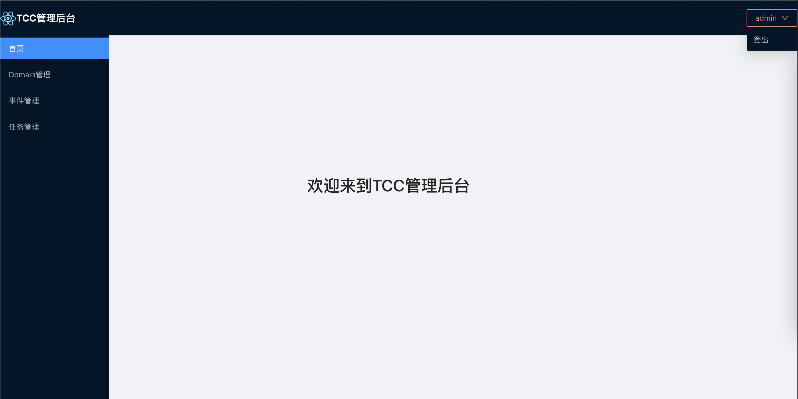  

## Domain管理  
主要涉及功能：
- Domain列表
- 新增Domain
- 修改Domain
- 删除Domain
- 告警测试
### Domain列表
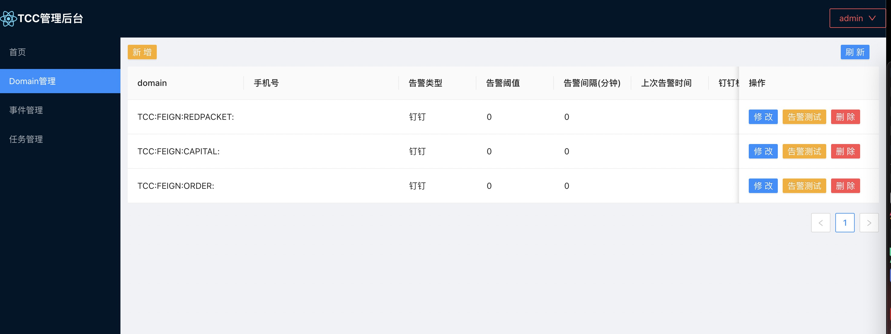

### 新增Domain
正常情况下tcc客户端启动时会自动注册domain，如果注册不成功可通过此功能来**新增Domain**  
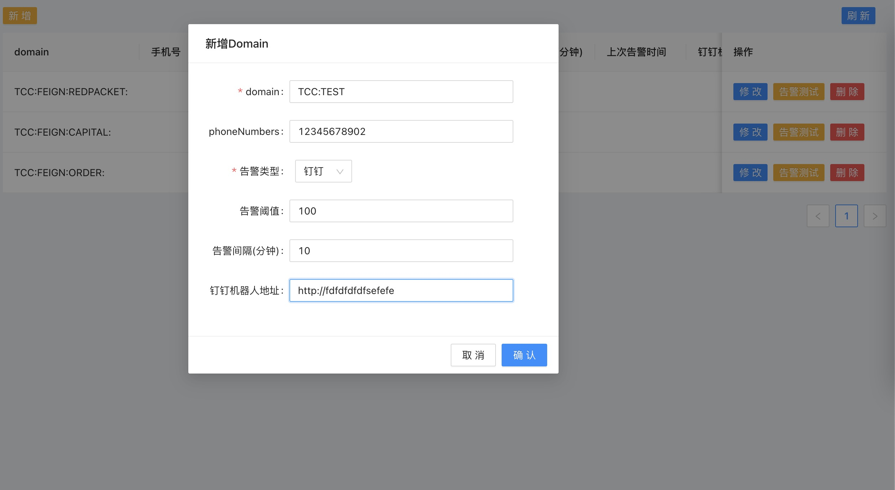

#### 字段说明
- doamin, 必输，具有唯一性，一般与服务一一对应   
- 手机号列表, 多个以英文逗号分割，不填告警不会生效
- 告警类型，暂时仅支持**钉钉**
- 告警阈值，这里阈值主要异常事件堆积数达到一定值时会触发告警
- 告警间隔(分钟)，为了避免频繁重复告警而设置
- 钉钉机器人地址，被告警的钉钉群，机器人webhook地址，操作步骤如下
> 第一步 打开钉钉群->打开智能群助手，进入**机器人管理页面**  
> 第二步 点击**自定义机器人**->点击**添加**按钮，进入机器人设置页面，关键字务必为**TCC告警**，否则会导致告警不生效
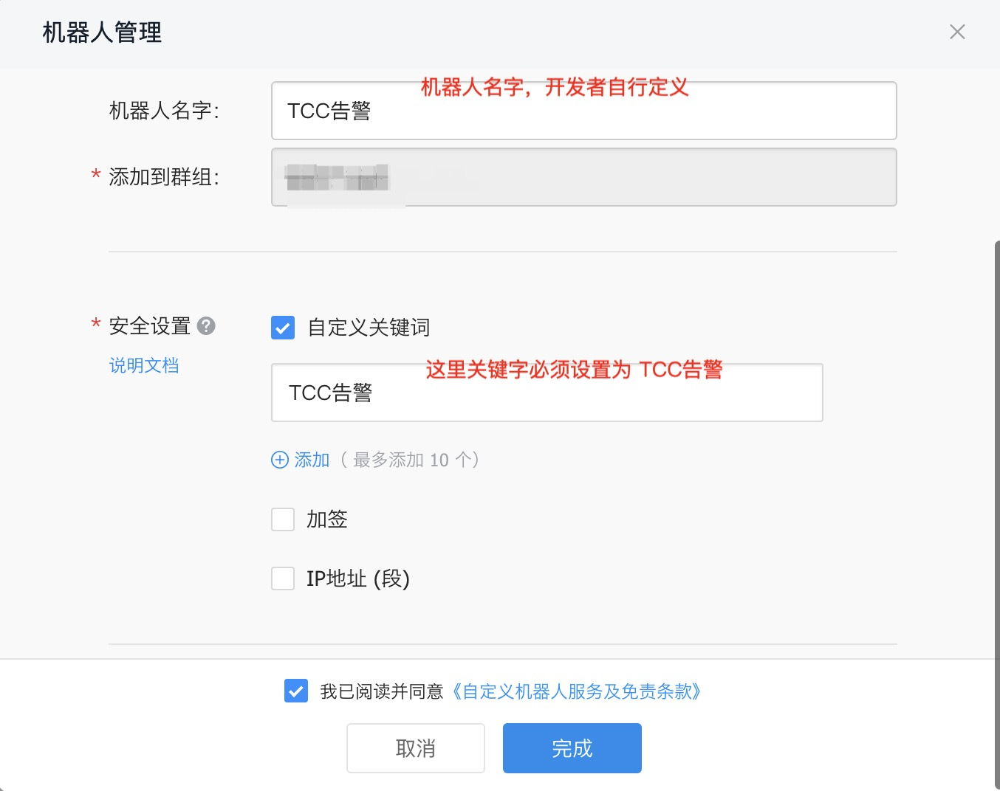    
> 第三步 复制webhook地址，即为所得   
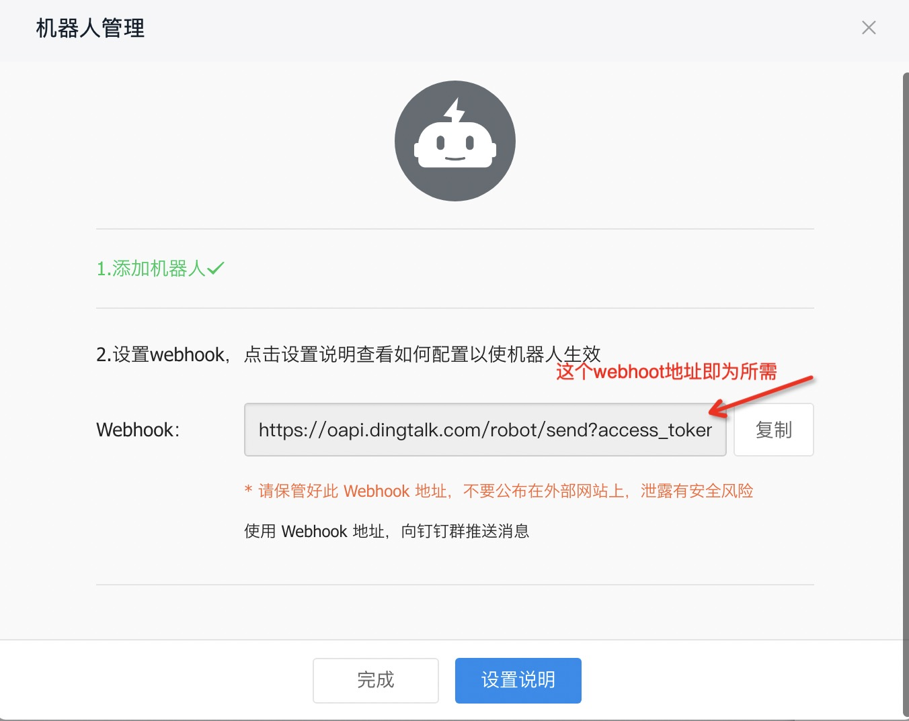
  
#### 异常事件堆积告警效果
**注意**：当前手机号列表为空、告警阈值<=0、钉钉机器人地址为空，满足其一时，告警将不会触发。  
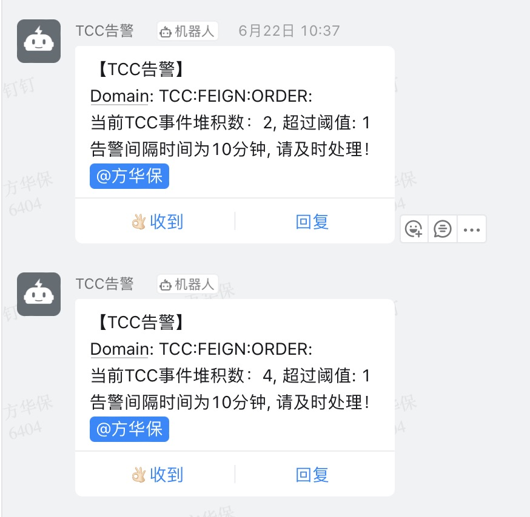

### 修改Domain
当需要变更除domain的其他配置时，可使用此功能。

### 删除Domain
当tcc服务下线或者需要删除无效doamin时，可使用此功能。  
**注意**：dashboard server模式下删除domain会同时删除对应的定时任务
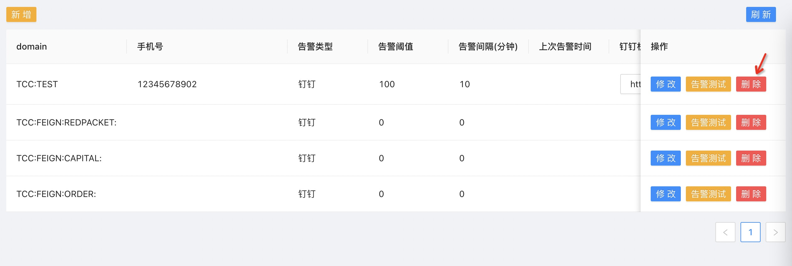

### 告警测试
当前仅支持钉钉告警测试  
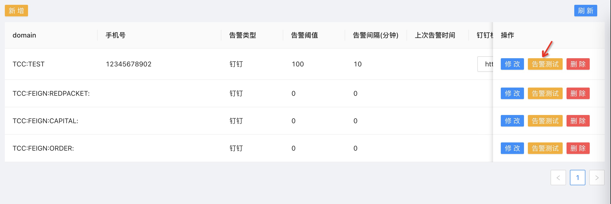
以下为钉钉告警测试效果  
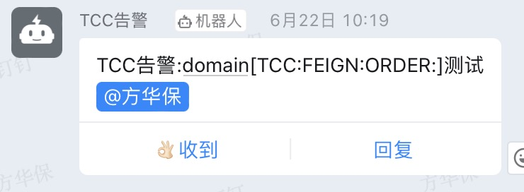
## 事件管理
主要涉及功能：
- 事件分页查询
- 事件批量确认
- 事件批量取消
- 事件批量重置
- 事件批量删除
- 事件详情
- 已删除事件分页查询
- 已删除事件批量恢复

### 事件分页查询
查询条件支持：domain和xid  
**注意**：这里点击查询按钮，最多会一次性从后端查询1000条事件，然后进行前端分页。  
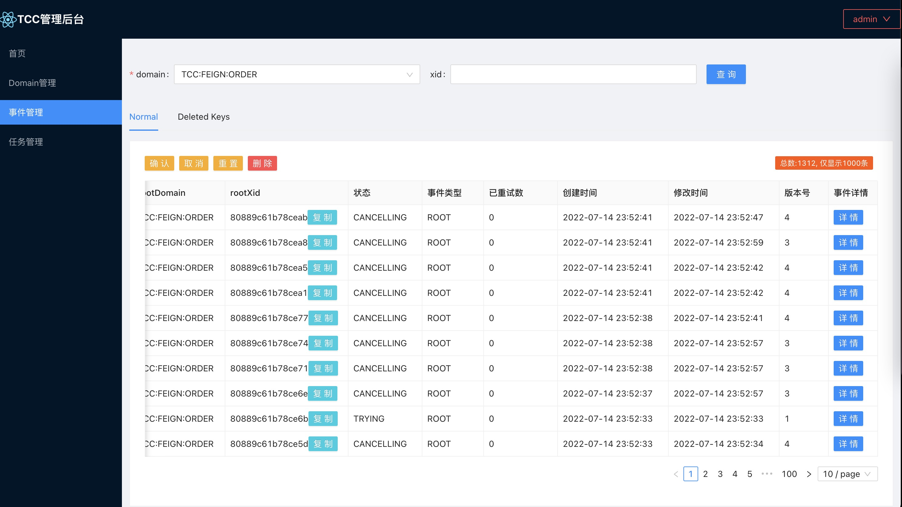  

### 事件批量确认
批量更新事件状态为COMFIRMING  
### 事件批量取消
批量更新事件状态为CANCELING  
### 事件批量重置
批量更新事件重试次数为0，方便事件被补偿任务重新执行    
### 事件批量删除
这里删除是软删除，批量将事件更新为删除状态    
### 事件详情  
展示事件内容信息，比如参与方信息等  
**注意**: 嵌入模式下且事件内容采用kryo序列化的场景，详细展示会解析异常，会降级为base64字符串展示，可复制该字符串去源服务解析。  
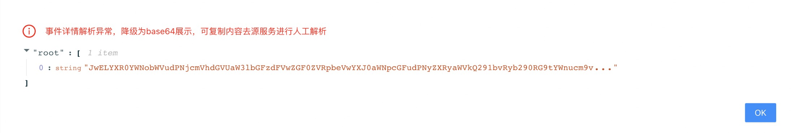
### 已删除事件分页查询
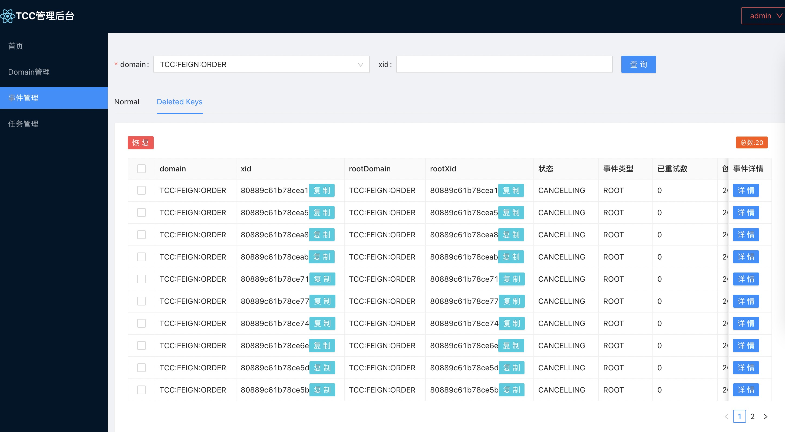  
### 已删除事件批量恢复
这里删除是软删除，批量将已删除状态的事件更新为正常状态    

## 任务管理
这里是对补偿任务的管理，仅仅在dashboard server模式才支持。   
dashboard server模式部署[点这里](/zh-cn/docs/ops/dashboard/deploy-server.html)  
主要涉及功能  
- 任务分页查询  
- 任务暂停、恢复  
- 修改cron表达式  

  
