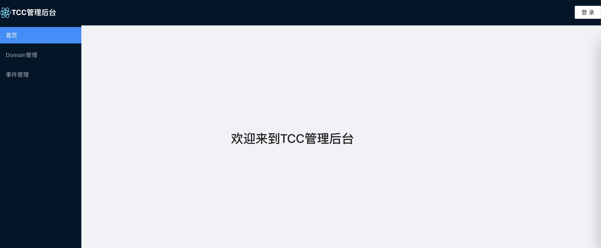

# dashboard server模式部署
存储模式为server模式，即通过调用server来实现存储操作。
另外此模式支持任务管理，需要配置quartz cluster数据库链接
## 前置条件
初始化[quartz数据库脚本](https://github.com/changmingxie/tcc-transaction/blob/master-2.x/tcc-transaction-server/src/main/dbscripts/db_init.sql)  
[server部署](/zh-cn/docs/ops/tccserver/index.html)  

## 安装并部署
下载最新[RELEASE](https://github.com/changmingxie/tcc-transaction/releases)版本
### linux/mac环境

**创建dashboard目录**
```shell script
makdir dashboard 
cd  dashboard  
```
**下载tcc-transaction-dashboard-xxx.tar.gz**，解压到dashboard目录  
```shell script
dashboard % tar zxvf tcc-transaction-dashboard-2.0.0.tar.gz 
x conf/application.yaml
x lib/tcc-transaction-dashboard.jar
x conf/
x conf/logback.xml
x bin/
x bin/startup.sh
x bin/startup.cmd
x bin/shutdown.sh
x bin/shutdown.cmd
dashboard % tree
.
├── bin
│         ├── shutdown.cmd
│         ├── shutdown.sh
│         ├── startup.cmd
│         └── startup.sh
├── conf
│         ├── application.yaml
│         └── logback.xml
├── lib
│         └── tcc-transaction-dashboard.jar
└── tcc-transaction-dashboard-2.0.0.tar.gz

3 directories, 8 files
dashboard % 
```
conf/application.yaml配置[详见](/zh-cn/docs/tutorial/configurations.html#dashbaord)  
  
**启动dashboard**
```shell script
sh bin/startup.sh
```
### windows环境  
- 创建dashboard目录。
- 下载tcc-transaction-dashboard-xxx.zip，到dashboard目录，并解压。
- 双击bin/startup.cmd，启动dashboard。
- 双击bin/shutdown.cmd，停止dashboard。

### 打开dashbaord
默认地址为：http://localhost:22332/tcc-transaction-dashboard  
默认用户名密码: admin/123456
  


## 注册中心
server模式下，需要和server服务交互。  
**注意**: dashboard选择nacos或者zookeeper注册中心，前提是server端以对应的注册中心来暴露。   
这里提供了三种server服务发现的方式：
- direct(默认)
- nacos
- zookeeper  

### direct(默认)
application.yaml可如下配置  

```yaml
server:
  servlet:
    context-path: /tcc-transaction-dashboard
  port: 22332

logging:
  level:
    root: info
spring:
  application:
    name: tcc-transaction-dashboard
  tcc:
    dashboard:
      userName: admin
      password: 123456
      connection-mode: server
      registry: # connection-mode为server时使用
        registry-type: direct
        direct:
          server-addresses: http://localhost:12332
    recovery:
      quartz-clustered: true
      quartz-data-source-url: jdbc:mysql://localhost:3306/TCC_SERVER?useSSL=false&allowPublicKeyRetrieval=true
      quartz-data-source-driver: com.mysql.jdbc.Driver
      quartz-data-source-user: root
      quartz-data-source-password: welcome1

```


### nacos 
需要[安装nacos](https://nacos.io/zh-cn/docs/deployment.html)  
application.yaml可如下配置  

```yaml
server:
  servlet:
    context-path: /tcc-transaction-dashboard
  port: 22332

logging:
  level:
    root: info
spring:
  application:
    name: tcc-transaction-dashboard
  tcc:
    dashboard:
      userName: admin
      password: 123456
      connection-mode: server
      registry: # connection-mode为server时使用
        registry-type: nacos
        nacos:
          server-addr: localhost:8848
    recovery:
      quartz-clustered: true
      quartz-data-source-url: jdbc:mysql://localhost:3306/TCC_SERVER?useSSL=false&allowPublicKeyRetrieval=true
      quartz-data-source-driver: com.mysql.jdbc.Driver
      quartz-data-source-user: root
      quartz-data-source-password: welcome1

```


### zookeeper 
需要安装zookeeper  
application.yaml可如下配置  

```yaml
server:
  servlet:
    context-path: /tcc-transaction-dashboard
  port: 22332

logging:
  level:
    root: info
spring:
  application:
    name: tcc-transaction-dashboard
  tcc:
    dashboard:
      userName: admin
      password: 123456
      connection-mode: server
      registry: # connection-mode为server时使用
        registry-type: zookeeper
        zookeeper:
          connect-string: localhost:2181
    recovery:
      quartz-clustered: true
      quartz-data-source-url: jdbc:mysql://localhost:3306/TCC_SERVER?useSSL=false&allowPublicKeyRetrieval=true
      quartz-data-source-driver: com.mysql.jdbc.Driver
      quartz-data-source-user: root
      quartz-data-source-password: welcome1

```
