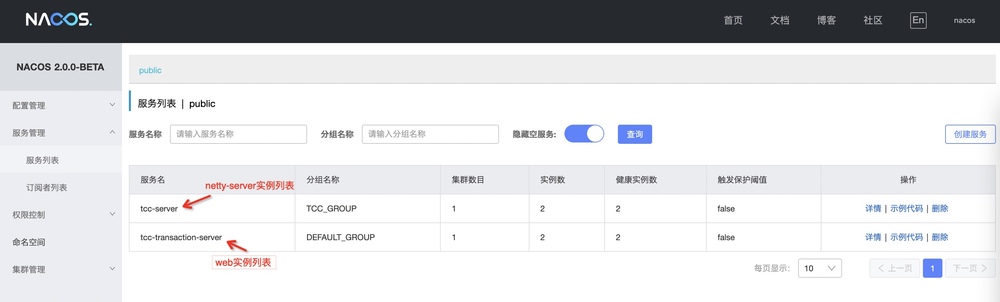
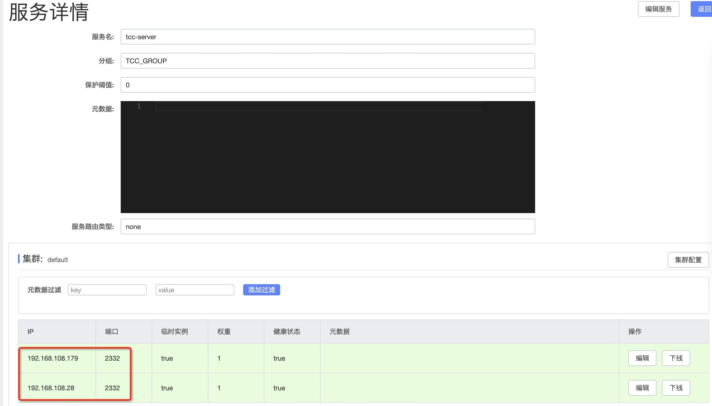
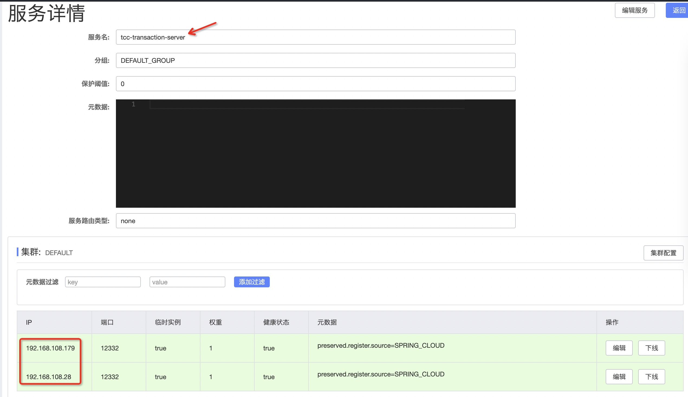

# server集群部署
适用于生产环境，需要保证高可用。  
注册中心推荐使用：nacos、zookeeper    
存储类型推荐使用： jdbc、 redis、shard-redis、redis-cluster   
任务部署方式推荐采用：quartz集群模式       

以下以注册中心[nacos]+存储类型[redis]+任务部署类型[quartz集群模式]这种组合为例。
## 准备阶段
###  准备至少两台机器
实例1：192.168.108.179  
实例2：192.168.108.28  
**注意**: 对于nacos、redis、mysql正常情况是需要独立实例部署的，这里考虑到机器资源有限，暂时在实例1上部署了。  
###  安装nacos
地址为：192.168.108.179:8848
### 安装redis
地址为：192.168.108.179:6379
### 初始化quartz数据库
在192.168.108.179创建数据库
这里使用mysql数据库，最新脚本请[查看](https://github.com/changmingxie/tcc-transaction/blob/master-2.x/tcc-transaction-server/src/main/dbscripts/db_init.sql)
```sql
CREATE
DATABASE IF NOT EXISTS `TCC_SERVER` CHARACTER SET 'utf8mb4' COLLATE 'utf8mb4_unicode_ci';

USE
`TCC_SERVER`;

DROP TABLE IF EXISTS QRTZ_FIRED_TRIGGERS;
DROP TABLE IF EXISTS QRTZ_PAUSED_TRIGGER_GRPS;
DROP TABLE IF EXISTS QRTZ_SCHEDULER_STATE;
DROP TABLE IF EXISTS QRTZ_LOCKS;
DROP TABLE IF EXISTS QRTZ_SIMPLE_TRIGGERS;
DROP TABLE IF EXISTS QRTZ_SIMPROP_TRIGGERS;
DROP TABLE IF EXISTS QRTZ_CRON_TRIGGERS;
DROP TABLE IF EXISTS QRTZ_BLOB_TRIGGERS;
DROP TABLE IF EXISTS QRTZ_TRIGGERS;
DROP TABLE IF EXISTS QRTZ_JOB_DETAILS;
DROP TABLE IF EXISTS QRTZ_CALENDARS;

CREATE TABLE QRTZ_JOB_DETAILS
(
    SCHED_NAME        VARCHAR(120) NOT NULL,
    JOB_NAME          VARCHAR(190) NOT NULL,
    JOB_GROUP         VARCHAR(190) NOT NULL,
    DESCRIPTION       VARCHAR(250) NULL,
    JOB_CLASS_NAME    VARCHAR(250) NOT NULL,
    IS_DURABLE        VARCHAR(1)   NOT NULL,
    IS_NONCONCURRENT  VARCHAR(1)   NOT NULL,
    IS_UPDATE_DATA    VARCHAR(1)   NOT NULL,
    REQUESTS_RECOVERY VARCHAR(1)   NOT NULL,
    JOB_DATA          BLOB NULL,
    PRIMARY KEY (SCHED_NAME, JOB_NAME, JOB_GROUP)
) ENGINE=InnoDB;

CREATE TABLE QRTZ_TRIGGERS
(
    SCHED_NAME     VARCHAR(120) NOT NULL,
    TRIGGER_NAME   VARCHAR(190) NOT NULL,
    TRIGGER_GROUP  VARCHAR(190) NOT NULL,
    JOB_NAME       VARCHAR(190) NOT NULL,
    JOB_GROUP      VARCHAR(190) NOT NULL,
    DESCRIPTION    VARCHAR(250) NULL,
    NEXT_FIRE_TIME BIGINT(13) NULL,
    PREV_FIRE_TIME BIGINT(13) NULL,
    PRIORITY       INTEGER NULL,
    TRIGGER_STATE  VARCHAR(16)  NOT NULL,
    TRIGGER_TYPE   VARCHAR(8)   NOT NULL,
    START_TIME     BIGINT(13) NOT NULL,
    END_TIME       BIGINT(13) NULL,
    CALENDAR_NAME  VARCHAR(190) NULL,
    MISFIRE_INSTR  SMALLINT(2) NULL,
    JOB_DATA       BLOB NULL,
    PRIMARY KEY (SCHED_NAME, TRIGGER_NAME, TRIGGER_GROUP),
    FOREIGN KEY (SCHED_NAME, JOB_NAME, JOB_GROUP)
        REFERENCES QRTZ_JOB_DETAILS (SCHED_NAME, JOB_NAME, JOB_GROUP)
) ENGINE=InnoDB;

CREATE TABLE QRTZ_SIMPLE_TRIGGERS
(
    SCHED_NAME      VARCHAR(120) NOT NULL,
    TRIGGER_NAME    VARCHAR(190) NOT NULL,
    TRIGGER_GROUP   VARCHAR(190) NOT NULL,
    REPEAT_COUNT    BIGINT(7) NOT NULL,
    REPEAT_INTERVAL BIGINT(12) NOT NULL,
    TIMES_TRIGGERED BIGINT(10) NOT NULL,
    PRIMARY KEY (SCHED_NAME, TRIGGER_NAME, TRIGGER_GROUP),
    FOREIGN KEY (SCHED_NAME, TRIGGER_NAME, TRIGGER_GROUP)
        REFERENCES QRTZ_TRIGGERS (SCHED_NAME, TRIGGER_NAME, TRIGGER_GROUP)
) ENGINE=InnoDB;

CREATE TABLE QRTZ_CRON_TRIGGERS
(
    SCHED_NAME      VARCHAR(120) NOT NULL,
    TRIGGER_NAME    VARCHAR(190) NOT NULL,
    TRIGGER_GROUP   VARCHAR(190) NOT NULL,
    CRON_EXPRESSION VARCHAR(120) NOT NULL,
    TIME_ZONE_ID    VARCHAR(80),
    PRIMARY KEY (SCHED_NAME, TRIGGER_NAME, TRIGGER_GROUP),
    FOREIGN KEY (SCHED_NAME, TRIGGER_NAME, TRIGGER_GROUP)
        REFERENCES QRTZ_TRIGGERS (SCHED_NAME, TRIGGER_NAME, TRIGGER_GROUP)
) ENGINE=InnoDB;

CREATE TABLE QRTZ_SIMPROP_TRIGGERS
(
    SCHED_NAME    VARCHAR(120) NOT NULL,
    TRIGGER_NAME  VARCHAR(190) NOT NULL,
    TRIGGER_GROUP VARCHAR(190) NOT NULL,
    STR_PROP_1    VARCHAR(512) NULL,
    STR_PROP_2    VARCHAR(512) NULL,
    STR_PROP_3    VARCHAR(512) NULL,
    INT_PROP_1    INT NULL,
    INT_PROP_2    INT NULL,
    LONG_PROP_1   BIGINT NULL,
    LONG_PROP_2   BIGINT NULL,
    DEC_PROP_1    NUMERIC(13, 4) NULL,
    DEC_PROP_2    NUMERIC(13, 4) NULL,
    BOOL_PROP_1   VARCHAR(1) NULL,
    BOOL_PROP_2   VARCHAR(1) NULL,
    PRIMARY KEY (SCHED_NAME, TRIGGER_NAME, TRIGGER_GROUP),
    FOREIGN KEY (SCHED_NAME, TRIGGER_NAME, TRIGGER_GROUP)
        REFERENCES QRTZ_TRIGGERS (SCHED_NAME, TRIGGER_NAME, TRIGGER_GROUP)
) ENGINE=InnoDB;

CREATE TABLE QRTZ_BLOB_TRIGGERS
(
    SCHED_NAME    VARCHAR(120) NOT NULL,
    TRIGGER_NAME  VARCHAR(190) NOT NULL,
    TRIGGER_GROUP VARCHAR(190) NOT NULL,
    BLOB_DATA     BLOB NULL,
    PRIMARY KEY (SCHED_NAME, TRIGGER_NAME, TRIGGER_GROUP),
    INDEX (SCHED_NAME, TRIGGER_NAME, TRIGGER_GROUP),
    FOREIGN KEY (SCHED_NAME, TRIGGER_NAME, TRIGGER_GROUP)
        REFERENCES QRTZ_TRIGGERS (SCHED_NAME, TRIGGER_NAME, TRIGGER_GROUP)
) ENGINE=InnoDB;

CREATE TABLE QRTZ_CALENDARS
(
    SCHED_NAME    VARCHAR(120) NOT NULL,
    CALENDAR_NAME VARCHAR(190) NOT NULL,
    CALENDAR      BLOB         NOT NULL,
    PRIMARY KEY (SCHED_NAME, CALENDAR_NAME)
) ENGINE=InnoDB;

CREATE TABLE QRTZ_PAUSED_TRIGGER_GRPS
(
    SCHED_NAME    VARCHAR(120) NOT NULL,
    TRIGGER_GROUP VARCHAR(190) NOT NULL,
    PRIMARY KEY (SCHED_NAME, TRIGGER_GROUP)
) ENGINE=InnoDB;

CREATE TABLE QRTZ_FIRED_TRIGGERS
(
    SCHED_NAME        VARCHAR(120) NOT NULL,
    ENTRY_ID          VARCHAR(95)  NOT NULL,
    TRIGGER_NAME      VARCHAR(190) NOT NULL,
    TRIGGER_GROUP     VARCHAR(190) NOT NULL,
    INSTANCE_NAME     VARCHAR(190) NOT NULL,
    FIRED_TIME        BIGINT(13) NOT NULL,
    SCHED_TIME        BIGINT(13) NOT NULL,
    PRIORITY          INTEGER      NOT NULL,
    STATE             VARCHAR(16)  NOT NULL,
    JOB_NAME          VARCHAR(190) NULL,
    JOB_GROUP         VARCHAR(190) NULL,
    IS_NONCONCURRENT  VARCHAR(1) NULL,
    REQUESTS_RECOVERY VARCHAR(1) NULL,
    PRIMARY KEY (SCHED_NAME, ENTRY_ID)
) ENGINE=InnoDB;

CREATE TABLE QRTZ_SCHEDULER_STATE
(
    SCHED_NAME        VARCHAR(120) NOT NULL,
    INSTANCE_NAME     VARCHAR(190) NOT NULL,
    LAST_CHECKIN_TIME BIGINT(13) NOT NULL,
    CHECKIN_INTERVAL  BIGINT(13) NOT NULL,
    PRIMARY KEY (SCHED_NAME, INSTANCE_NAME)
) ENGINE=InnoDB;

CREATE TABLE QRTZ_LOCKS
(
    SCHED_NAME VARCHAR(120) NOT NULL,
    LOCK_NAME  VARCHAR(40)  NOT NULL,
    PRIMARY KEY (SCHED_NAME, LOCK_NAME)
) ENGINE=InnoDB;

CREATE INDEX IDX_QRTZ_J_REQ_RECOVERY ON QRTZ_JOB_DETAILS (SCHED_NAME, REQUESTS_RECOVERY);
CREATE INDEX IDX_QRTZ_J_GRP ON QRTZ_JOB_DETAILS (SCHED_NAME, JOB_GROUP);

CREATE INDEX IDX_QRTZ_T_J ON QRTZ_TRIGGERS (SCHED_NAME, JOB_NAME, JOB_GROUP);
CREATE INDEX IDX_QRTZ_T_JG ON QRTZ_TRIGGERS (SCHED_NAME, JOB_GROUP);
CREATE INDEX IDX_QRTZ_T_C ON QRTZ_TRIGGERS (SCHED_NAME, CALENDAR_NAME);
CREATE INDEX IDX_QRTZ_T_G ON QRTZ_TRIGGERS (SCHED_NAME, TRIGGER_GROUP);
CREATE INDEX IDX_QRTZ_T_STATE ON QRTZ_TRIGGERS (SCHED_NAME, TRIGGER_STATE);
CREATE INDEX IDX_QRTZ_T_N_STATE ON QRTZ_TRIGGERS (SCHED_NAME, TRIGGER_NAME, TRIGGER_GROUP, TRIGGER_STATE);
CREATE INDEX IDX_QRTZ_T_N_G_STATE ON QRTZ_TRIGGERS (SCHED_NAME, TRIGGER_GROUP, TRIGGER_STATE);
CREATE INDEX IDX_QRTZ_T_NEXT_FIRE_TIME ON QRTZ_TRIGGERS (SCHED_NAME, NEXT_FIRE_TIME);
CREATE INDEX IDX_QRTZ_T_NFT_ST ON QRTZ_TRIGGERS (SCHED_NAME, TRIGGER_STATE, NEXT_FIRE_TIME);
CREATE INDEX IDX_QRTZ_T_NFT_MISFIRE ON QRTZ_TRIGGERS (SCHED_NAME, MISFIRE_INSTR, NEXT_FIRE_TIME);
CREATE INDEX IDX_QRTZ_T_NFT_ST_MISFIRE ON QRTZ_TRIGGERS (SCHED_NAME, MISFIRE_INSTR, NEXT_FIRE_TIME, TRIGGER_STATE);
CREATE INDEX IDX_QRTZ_T_NFT_ST_MISFIRE_GRP ON QRTZ_TRIGGERS (SCHED_NAME, MISFIRE_INSTR, NEXT_FIRE_TIME, TRIGGER_GROUP,
                                                             TRIGGER_STATE);

CREATE INDEX IDX_QRTZ_FT_TRIG_INST_NAME ON QRTZ_FIRED_TRIGGERS (SCHED_NAME, INSTANCE_NAME);
CREATE INDEX IDX_QRTZ_FT_INST_JOB_REQ_RCVRY ON QRTZ_FIRED_TRIGGERS (SCHED_NAME, INSTANCE_NAME, REQUESTS_RECOVERY);
CREATE INDEX IDX_QRTZ_FT_J_G ON QRTZ_FIRED_TRIGGERS (SCHED_NAME, JOB_NAME, JOB_GROUP);
CREATE INDEX IDX_QRTZ_FT_JG ON QRTZ_FIRED_TRIGGERS (SCHED_NAME, JOB_GROUP);
CREATE INDEX IDX_QRTZ_FT_T_G ON QRTZ_FIRED_TRIGGERS (SCHED_NAME, TRIGGER_NAME, TRIGGER_GROUP);
CREATE INDEX IDX_QRTZ_FT_TG ON QRTZ_FIRED_TRIGGERS (SCHED_NAME, TRIGGER_GROUP);

commit;

```

### 下载最新[RELEASE](https://github.com/changmingxie/tcc-transaction/releases)版本
下载最新的安装包tcc-transaction-server-xxx.tar.gz

## 实例1安装并启动
### 第一步 创建server目录并解压
```shell script
% makdir server 
% cd  server  
server % tar zxvf tcc-transaction-server-2.0.0.tar.gz
x conf/application.yaml
x lib/tcc-transaction-server.jar
x conf/
x conf/logback.xml
x bin/
x bin/startup.sh
x bin/startup.cmd
x bin/shutdown.sh
x bin/shutdown.cmd
server % tree
.
├── bin
│         ├── shutdown.cmd
│         ├── shutdown.sh
│         ├── startup.cmd
│         └── startup.sh
├── conf
│         ├── application.yaml
│         └── logback.xml
├── lib
│         └── tcc-transaction-server.jar
└── tcc-transaction-server-2.0.0.tar.gz

3 directories, 8 files
server % 
```


### 第二步 修改application.yaml配置
[参数说明详见](/zh-cn/docs/tutorial/configurations.html#server端)  
这里以注册中心[nacos]+存储类型[redis]+任务部署类型[quartz集群模式]为例，对应的application.yaml可如下
```yaml
server:
  port: 12332
logging:
  level:
    root: info
spring:
  application:
    name: tcc-transaction-server
  tcc:
    storage:
      storage-type: redis
      redis:
        host: 192.168.108.179
        port: 6379
        database: 0
        pool-config:
          max-total: 100
          max-idle: 100
          min-idle: 10
          max-wait-millis: 300
    recovery:
      recovery-enabled: true
      update-job-forcibly: false
      quartz-clustered: true
      quartz-data-source-url: jdbc:mysql://192.168.108.179:3306/TCC_SERVER?useSSL=false&allowPublicKeyRetrieval=true
      quartz-data-source-driver: com.mysql.jdbc.Driver
      quartz-data-source-user: root
      quartz-data-source-password: welcome1
    registry:
      registry-type: nacos
      cluster-name: default
      nacos:
        server-addr: 192.168.108.179:8848
    remoting:
      listen-port: 2332

```  


### 第三步 启动server
```shell script
sh bin/startup.sh
```

## 实例2安装并启动
参考**实例1安装并启动**


## 验证
实例1和实例2正常启动后，会在nacos显示如下信息。

**netty-server实例注册成功**，见下图

**web实例注册成功**，见下图


恭喜你，server集群模式搭建完成！
