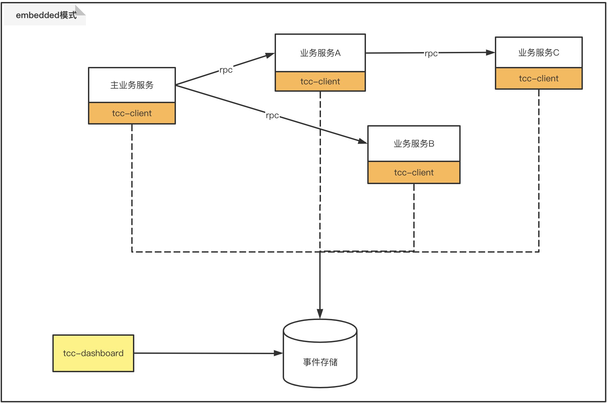

# embedded模式
此模式是区分server模式而言，此模式需要嵌入存储的场景。  
当前支持的存储方式有：  
- memory  
- rocksdb  
- jdbc  
- redis  
- shard_redis  
- redis_cluster  

**注意：** 对于tcc-transaction-1.x本质上也属于embedded模式
  
[embedded模式示例](/zh-cn/docs/tutorial/quickstart/embedded-sample.html)  

## 架构

