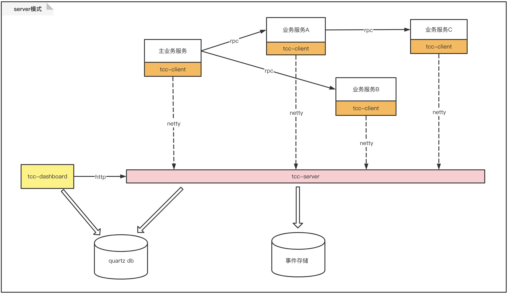

# server模式
tcc-transaction-2.x版本新增此模式，此模式将存储及补偿的相关操作，交由一个server服务来执行，此服务实现了事件存储、补偿任务的集中管理。   
简化了1.x中的存储和补偿任务的复杂配置。给开发者带来一种新的选择。  
  
[server模式示例](/zh-cn/docs/tutorial/quickstart/server-sample.html)    
  
## 架构
    

