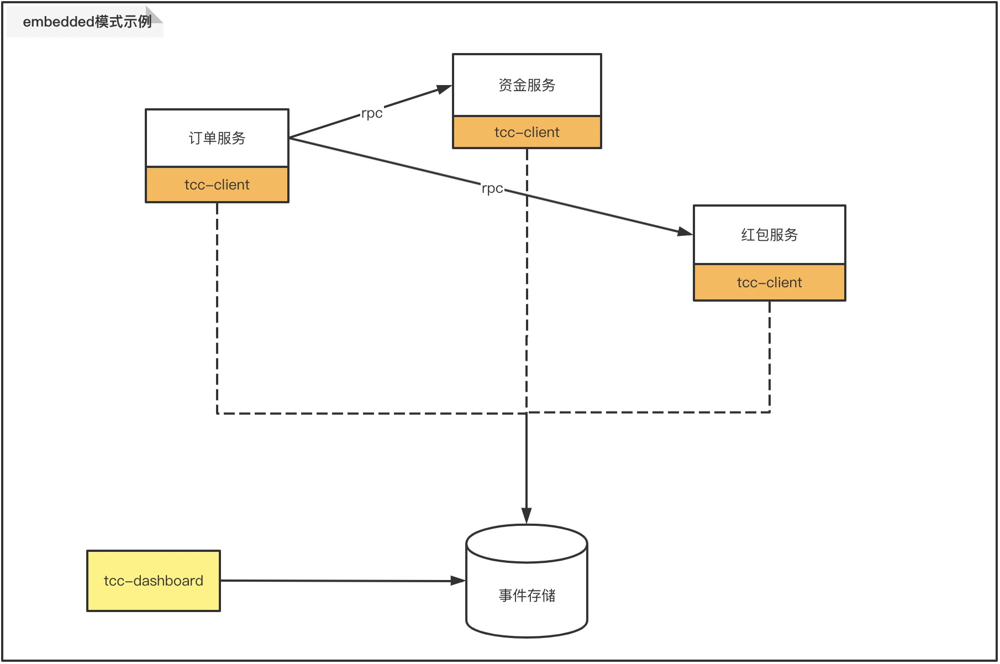
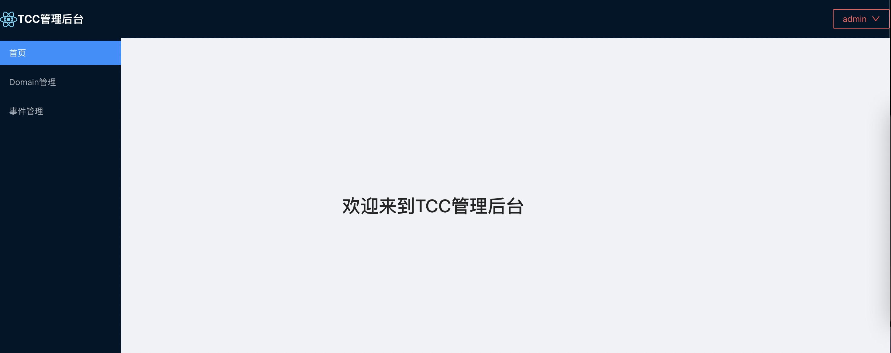
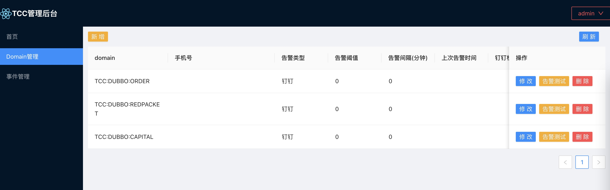
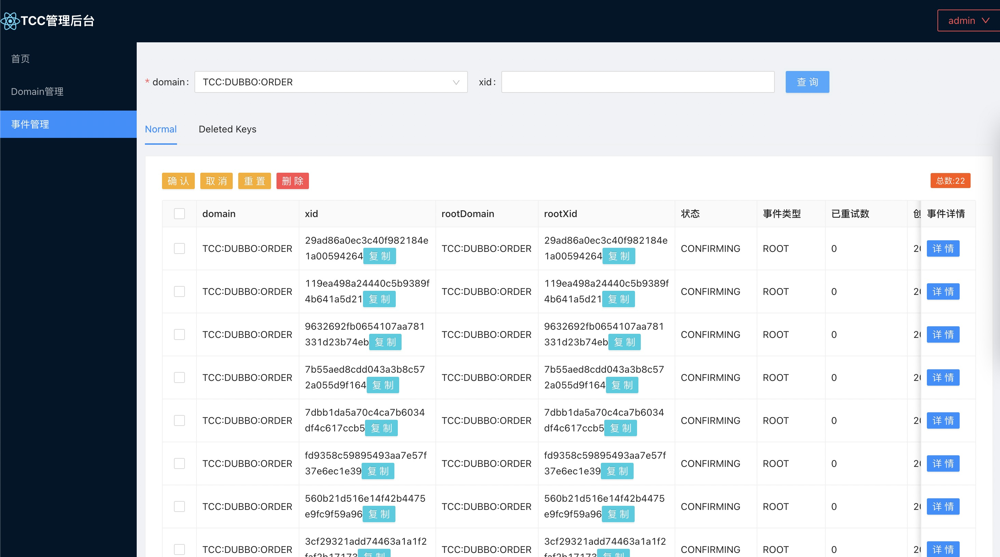

# embedded模式示例
**注意**：tcc-transaction-1.x版本均为embedded模式，其使用方式[详见](https://github.com/changmingxie/tcc-transaction/wiki/2-%E5%BF%AB%E9%80%9F%E5%BC%80%E5%A7%8B)  

这里用dubbo-sample来介绍如何使用tcc-transaction的[**embedded模式**](/zh-cn/docs/tutorial/connectionmode/embedded.html)  

**示例工程:**[tcc-transaction-dubbo-sample](https://github.com/changmingxie/tcc-transaction/tree/master-2.x/tcc-transaction-tutorial-sample/tcc-transaction-dubbo-sample) 
> tcc-transaction-dubbo-capital(资金服务)  
> tcc-transaction-dubbo-redpacket(红包服务)  
> tcc-transaction-dubbo-order(订单服务)   

**sample特征**：
- 采用dubbo的远程调用方式    
- springboot启动，springxml配置tcc  
- 采用tcc-transaction的embedded模式+存储类型(memory/redis) 

**示例图**  
  

以下将一步一步教大家如何使用tcc-transaction的embedded模式  
**步骤如下**
- dashboard部署  
- 资金服务开发  
- 红包服务开发  
- 订单服务开发  
- 功能演示  

## dashboard部署
如资金服务、红包服务、订单服务采用的embedded存储类型为redis，可以结合dashboard演示。
[dashboard embedded模式部署](/zh-cn/docs/ops/dashboard/deploy-embedded.html)  
对应application.yaml可如下配置(embedded模式redis)  
```yaml
server:
  servlet:
    context-path: /tcc-transaction-dashboard
  port: 22332
logging:
  level:
    root: info
spring:
  application:
    name: tcc-transaction-dashboard
  tcc:
    dashboard:
      data-fetch-type: local
    storage:
      storage-type: redis
      redis:
        host: 127.0.0.1
        port: 6379
        database: 0
        pool-config:
          max-total: 100
          max-idle: 100
          min-idle: 10
          max-wait-millis: 300
```


## 资金服务开发
涉及两个模块的开发：  
- tcc-transaction-dubbo-capital-api，方便调用方使用接口定义 
- tcc-transaction-dubbo-capital，提供资金相关操作实现、服务暴露等功能  

### tcc-transaction-dubbo-capital-api开发
方便调用方使用资金服务的接口定义  
#### 添加maven依赖
请选用[最新版本](https://github.com/changmingxie/tcc-transaction/releases)
```xml
<!--tcc依赖-->
<dependency>
    <groupId>org.mengyun</groupId>
    <artifactId>tcc-transaction-api</artifactId>
    <version>${tcc-transaction.version}</version>
</dependency>
```

#### 声明tcc接口
使用[@EnableTcc](/zh-cn/docs/tutorial/api.html#%40enabletcc)传递上下文

```java
public interface CapitalTradeOrderService {
    @EnableTcc
    public String record(CapitalTradeOrderDto tradeOrderDto);
}
```

### tcc-transaction-dubbo-capital开发  
提供资金相关操作实现、服务暴露等功能  
#### 添加maven依赖

请选用[最新版本](https://github.com/changmingxie/tcc-transaction/releases)
```xml
<!--tcc依赖-->
<dependency>
    <groupId>org.mengyun</groupId>
    <artifactId>tcc-transaction-dubbo</artifactId>
    <version>${tcc-transaction.version}</version>
</dependency>

<dependency>
    <groupId>org.mengyun</groupId>
    <artifactId>tcc-transaction-spring</artifactId>
    <version>${tcc-transaction.version}</version>
</dependency>
```


#### spring xml配置
appcontext-service-tcc.xml开发，这里提供了embedded模式的两种配置，您可以选择一种配置：  
- embedded存储模式之MEMORY  
- embedded存储模式之REDIS(如需演示dashboard，可选择此中存储类型)     

##### embedded存储模式之MEMORY
```xml
<?xml version="1.0" encoding="UTF-8"?>
<beans xmlns:xsi="http://www.w3.org/2001/XMLSchema-instance"
       xmlns:tcc="http://www.tcctransaction.org/schema/tcc" xmlns="http://www.springframework.org/schema/beans"
       xsi:schemaLocation="http://www.springframework.org/schema/beans http://www.springframework.org/schema/beans/spring-beans.xsd http://www.tcctransaction.org/schema/tcc http://www.tcctransaction.org/schema/tcc.xsd">

    <!--驱动TccClient-->
    <tcc:annotation-driven client-config="clientConfig"/>

    <bean class="org.mengyun.tcctransaction.ClientConfig" id="clientConfig">
        <property name="recoveryConfig">
            <bean class="org.mengyun.tcctransaction.properties.RecoveryProperties">
                <!--开启补偿任务-->
                <property name="recoveryEnabled" value="true"/>
            </bean>
        </property>
        <property name="storeConfig">
            <bean class="org.mengyun.tcctransaction.properties.store.StoreProperties">
                <property name="domain" value="TCC:DUBBO:CAPITAL"/>
                <!--embedded存储模式(MEMORY)-->
                <property name="storageType" value="MEMORY"/>
            </bean>
        </property>
    </bean>

</beans>

```

##### embedded存储模式之REDIS
```xml
<?xml version="1.0" encoding="UTF-8"?>
<beans xmlns:xsi="http://www.w3.org/2001/XMLSchema-instance"
       xmlns:tcc="http://www.tcctransaction.org/schema/tcc" xmlns="http://www.springframework.org/schema/beans"
       xsi:schemaLocation="http://www.springframework.org/schema/beans http://www.springframework.org/schema/beans/spring-beans.xsd http://www.tcctransaction.org/schema/tcc http://www.tcctransaction.org/schema/tcc.xsd">

    <!--驱动TccClient-->
    <tcc:annotation-driven client-config="clientConfig"/>

    <bean class="org.mengyun.tcctransaction.ClientConfig" id="clientConfig">
        <property name="recoveryConfig">
            <bean class="org.mengyun.tcctransaction.properties.RecoveryProperties">
                <!--开启补偿任务-->
                <property name="recoveryEnabled" value="true"/>
            </bean>
        </property>
        <property name="storeConfig">
            <bean class="org.mengyun.tcctransaction.properties.store.StoreProperties">
                <property name="domain" value="TCC:DUBBO:CAPITAL"/>
                <!--embedded存储模式(REDIS)-->
                <property name="storageType" value="REDIS"/>
                <property name="redis">
                    <bean class="org.mengyun.tcctransaction.properties.store.RedisStoreProperties">
                        <property name="host" value="127.0.0.1"/>
                        <property name="port" value="6379"/>
                        <property name="database" value="0"/>
                        <property name="poolConfig">
                            <bean class="redis.clients.jedis.JedisPoolConfig">
                                <property name="maxTotal" value="100"/>
                                <property name="maxIdle" value="100"/>
                                <property name="maxWaitMillis" value="300"/>
                                <property name="minIdle" value="10"/>
                            </bean>
                        </property>
                    </bean>
                </property>
            </bean>
        </property>
    </bean>

</beans>

```

#### tcc实现
在tcc实现上方法上添加[@Compensable](/zh-cn/docs/tutorial/api.html#%40compensable)注解，设置confirmMethod和cancelMethod方法，分别为tcc的confirm和cancel方法。    
**特别注意**：confirm和cancel方法参数要与try保持一致。   

```java
public class CapitalTradeOrderServiceImpl implements CapitalTradeOrderService {
    @Compensable(confirmMethod = "confirmRecord", cancelMethod = "cancelRecord")
    public String record(CapitalTradeOrderDto tradeOrderDto) {
        // do someting ...
        return "success";
    }

    public void confirmRecord(CapitalTradeOrderDto tradeOrderDto) {
        // do something ...
    }

    public void cancelRecord(CapitalTradeOrderDto tradeOrderDto) {
        // do something ...
    }
}

```
## 红包服务开发
涉及两个模块的开发：  
- tcc-transaction-dubbo-redpacket-api，方便调用方使用接口定义 
- tcc-transaction-dubbo-redpacket，提供红包相关操作实现、服务暴露等功能  

### tcc-transaction-dubbo-redpacket-api开发
方便调用方使用资金服务的接口定义  
#### 添加maven依赖
请选用[最新版本](https://github.com/changmingxie/tcc-transaction/releases)
```xml
<!--tcc依赖-->
<dependency>
    <groupId>org.mengyun</groupId>
    <artifactId>tcc-transaction-api</artifactId>
    <version>${tcc-transaction.version}</version>
</dependency>
```

#### 声明tcc接口
使用[@EnableTcc](/zh-cn/docs/tutorial/api.html#%40enabletcc)传递上下文

```java
public interface RedPacketTradeOrderService {
    @EnableTcc
    public String record(RedPacketTradeOrderDto tradeOrderDto);
}
```

### tcc-transaction-dubbo-redpacket开发  
提供红包相关操作实现、服务暴露等功能  
#### 添加maven依赖

请选用[最新版本](https://github.com/changmingxie/tcc-transaction/releases)
```xml
<!--tcc依赖-->
<dependency>
    <groupId>org.mengyun</groupId>
    <artifactId>tcc-transaction-dubbo</artifactId>
    <version>${tcc-transaction.version}</version>
</dependency>

<dependency>
    <groupId>org.mengyun</groupId>
    <artifactId>tcc-transaction-spring</artifactId>
    <version>${tcc-transaction.version}</version>
</dependency>
```


#### spring xml配置
appcontext-service-tcc.xml开发，这里提供了embedded模式的两种配置，您可以选择一种配置：  
- embedded存储模式之MEMORY  
- embedded存储模式之REDIS(如需演示dashboard，可选择此中存储类型)  

##### embedded存储模式之MEMORY
```xml
<?xml version="1.0" encoding="UTF-8"?>
<beans xmlns:xsi="http://www.w3.org/2001/XMLSchema-instance"
       xmlns:tcc="http://www.tcctransaction.org/schema/tcc" xmlns="http://www.springframework.org/schema/beans"
       xsi:schemaLocation="http://www.springframework.org/schema/beans http://www.springframework.org/schema/beans/spring-beans.xsd http://www.tcctransaction.org/schema/tcc http://www.tcctransaction.org/schema/tcc.xsd">

    <!--驱动TccClient-->
    <tcc:annotation-driven client-config="clientConfig"/>

    <bean class="org.mengyun.tcctransaction.ClientConfig" id="clientConfig">
        <property name="recoveryConfig">
            <bean class="org.mengyun.tcctransaction.properties.RecoveryProperties">
                <!--开启补偿任务-->
                <property name="recoveryEnabled" value="true"/>
            </bean>
        </property>
        <property name="storeConfig">
            <bean class="org.mengyun.tcctransaction.properties.store.StoreProperties">
                <property name="domain" value="TCC:DUBBO:REDPACKET"/>
                <!--embedded存储模式(MEMORY)-->
                <property name="storageType" value="MEMORY"/>
            </bean>
        </property>
    </bean>

</beans>

```

##### embedded存储模式之REDIS
```xml
<?xml version="1.0" encoding="UTF-8"?>
<beans xmlns:xsi="http://www.w3.org/2001/XMLSchema-instance"
       xmlns:tcc="http://www.tcctransaction.org/schema/tcc" xmlns="http://www.springframework.org/schema/beans"
       xsi:schemaLocation="http://www.springframework.org/schema/beans http://www.springframework.org/schema/beans/spring-beans.xsd http://www.tcctransaction.org/schema/tcc http://www.tcctransaction.org/schema/tcc.xsd">

    <!--驱动TccClient-->
    <tcc:annotation-driven client-config="clientConfig"/>

    <bean class="org.mengyun.tcctransaction.ClientConfig" id="clientConfig">
        <property name="recoveryConfig">
            <bean class="org.mengyun.tcctransaction.properties.RecoveryProperties">
                <!--开启补偿任务-->
                <property name="recoveryEnabled" value="true"/>
            </bean>
        </property>
        <property name="storeConfig">
            <bean class="org.mengyun.tcctransaction.properties.store.StoreProperties">
                <property name="domain" value="TCC:DUBBO:REDPACKET"/>
                <!--embedded存储模式(REDIS)-->
                <property name="storageType" value="REDIS"/>
                <property name="redis">
                    <bean class="org.mengyun.tcctransaction.properties.store.RedisStoreProperties">
                        <property name="host" value="127.0.0.1"/>
                        <property name="port" value="6379"/>
                        <property name="database" value="0"/>
                        <property name="poolConfig">
                            <bean class="redis.clients.jedis.JedisPoolConfig">
                                <property name="maxTotal" value="100"/>
                                <property name="maxIdle" value="100"/>
                                <property name="maxWaitMillis" value="300"/>
                                <property name="minIdle" value="10"/>
                            </bean>
                        </property>
                    </bean>
                </property>
            </bean>
        </property>
    </bean>

</beans>

```

#### tcc实现
在tcc实现上方法上添加[@Compensable](/zh-cn/docs/tutorial/api.html#%40compensable)注解，设置confirmMethod和cancelMethod方法，分别为tcc的confirm和cancel方法。    
**特别注意**：confirm和cancel方法参数要与try保持一致。  

```java
public class RedPacketTradeOrderServiceImpl implements RedPacketTradeOrderService {
    @Compensable(confirmMethod = "confirmRecord", cancelMethod = "cancelRecord")
    public String record(RedPacketTradeOrderDto tradeOrderDto) {
        return "success";
    }
    public void confirmRecord(RedPacketTradeOrderDto tradeOrderDto) {
        // do something ...
    }
    public void cancelRecord(RedPacketTradeOrderDto tradeOrderDto) {
        // do something ...
    }
}

```
## 订单服务开发  
提供下单支付相关功能，只有一个模块tcc-transaction-dubbo-order   

### tcc-transaction-dubbo-order开发  
提供下单支付相关功能   

#### 添加maven依赖

请选用[最新版本](https://github.com/changmingxie/tcc-transaction/releases)
```xml
<!--tcc依赖-->
<dependency>
    <groupId>org.mengyun</groupId>
    <artifactId>tcc-transaction-dubbo</artifactId>
    <version>${tcc-transaction.version}</version>
</dependency>

<dependency>
    <groupId>org.mengyun</groupId>
    <artifactId>tcc-transaction-spring</artifactId>
    <version>${tcc-transaction.version}</version>
</dependency>


```


#### spring xml配置
appcontext-service-tcc.xml开发，这里提供了embedded模式的两种配置，您可以选择一种配置：  
- embedded存储模式之MEMORY  
- embedded存储模式之REDIS(如需演示dashboard，可选择此中存储类型)     

##### embedded存储模式之MEMORY
```xml
<?xml version="1.0" encoding="UTF-8"?>
<beans xmlns:xsi="http://www.w3.org/2001/XMLSchema-instance"
       xmlns:tcc="http://www.tcctransaction.org/schema/tcc" xmlns="http://www.springframework.org/schema/beans"
       xsi:schemaLocation="http://www.springframework.org/schema/beans http://www.springframework.org/schema/beans/spring-beans.xsd http://www.tcctransaction.org/schema/tcc http://www.tcctransaction.org/schema/tcc.xsd">

    <!--驱动TccClient-->
    <tcc:annotation-driven client-config="clientConfig"/>

    <bean class="org.mengyun.tcctransaction.ClientConfig" id="clientConfig">
        <property name="recoveryConfig">
            <bean class="org.mengyun.tcctransaction.properties.RecoveryProperties">
                <!--开启补偿任务-->
                <property name="recoveryEnabled" value="true"/>
            </bean>
        </property>
        <property name="storeConfig">
            <bean class="org.mengyun.tcctransaction.properties.store.StoreProperties">
                <property name="domain" value="TCC:DUBBO:ORDER"/>
                <!--embedded存储模式(MEMORY)-->
                <property name="storageType" value="MEMORY"/>
            </bean>
        </property>
    </bean>

</beans>

```

##### embedded存储模式之REDIS
```xml
<?xml version="1.0" encoding="UTF-8"?>
<beans xmlns:xsi="http://www.w3.org/2001/XMLSchema-instance"
       xmlns:tcc="http://www.tcctransaction.org/schema/tcc" xmlns="http://www.springframework.org/schema/beans"
       xsi:schemaLocation="http://www.springframework.org/schema/beans http://www.springframework.org/schema/beans/spring-beans.xsd http://www.tcctransaction.org/schema/tcc http://www.tcctransaction.org/schema/tcc.xsd">

    <!--驱动TccClient-->
    <tcc:annotation-driven client-config="clientConfig"/>

    <bean class="org.mengyun.tcctransaction.ClientConfig" id="clientConfig">
        <property name="recoveryConfig">
            <bean class="org.mengyun.tcctransaction.properties.RecoveryProperties">
                <!--开启补偿任务-->
                <property name="recoveryEnabled" value="true"/>
            </bean>
        </property>
        <property name="storeConfig">
            <bean class="org.mengyun.tcctransaction.properties.store.StoreProperties">
                <property name="domain" value="TCC:DUBBO:ORDER"/>
                <!--embedded存储模式(REDIS)-->
                <property name="storageType" value="REDIS"/>
                <property name="redis">
                    <bean class="org.mengyun.tcctransaction.properties.store.RedisStoreProperties">
                        <property name="host" value="127.0.0.1"/>
                        <property name="port" value="6379"/>
                        <property name="database" value="0"/>
                        <property name="poolConfig">
                            <bean class="redis.clients.jedis.JedisPoolConfig">
                                <property name="maxTotal" value="100"/>
                                <property name="maxIdle" value="100"/>
                                <property name="maxWaitMillis" value="300"/>
                                <property name="minIdle" value="10"/>
                            </bean>
                        </property>
                    </bean>
                </property>
            </bean>
        </property>
    </bean>

</beans>

```

#### tcc实现
在tcc实现上方法上添加[@Compensable](/zh-cn/docs/tutorial/api.html#%40compensable)注解，设置confirmMethod和cancelMethod方法，分别为tcc的confirm和cancel方法。    
**特别注意**：confirm和cancel方法参数要与try保持一致。  

```java
@Service
public class PaymentServiceImpl {
    @Compensable(confirmMethod = "confirmMakePayment", cancelMethod = "cancelMakePayment", asyncConfirm = false)
    public void makePayment(@UniqueIdentity String orderNo) {
        String result = capitalTradeOrderService.record(buildCapitalTradeOrderDto(order));
        String result2 = redPacketTradeOrderService.record(buildRedPacketTradeOrderDto(order));
    }
    public void confirmMakePayment(String orderNo) {
        // do something ...
    }
    public void cancelMakePayment(String orderNo) {
        // do something ...
    }
}

```


## 功能演示
### 本地启动
分别启动tcc-transaction-dubbo-capital、tcc-transaction-dubbo-redpacket、tcc-transaction-dubbo-order

 
#### 测试页面演示
测试页面入口：http://localhost:8081 
  
选择购买商品

点击支付按钮

#### 日志演示
注意调用的先后顺序。  
try阶段
```text
1、order try make payment called.time seq:2022-07-13 17:46:04
2、capital try record called. time seq:2022-07-13 17:46:06
3、red packet try record called. time seq:2022-07-13 17:46:07
```
confirm阶段
```text
1、order confirm make payment called. time seq:2022-07-13 17:46:08
2、capital confirm record called. time seq:2022-07-13 17:46:09
3、red packet confirm record called. time seq:2022-07-13 17:46:10
```

#### dashboard演示
访问地址：http://localhost:22332/tcc-transaction-dashboard   
默认用户: admin   
默认密码：123456  
详细操作参考[dashboard使用手册](/zh-cn/docs/ops/dashboard/dashboard-guild.html)   

**首页**   
登录成功后进入首页   
  

**Domain管理**   
资金、红包、订单这三个服务启动，会自动注册domain  
  

**事件管理**  
出现异常事件，或者发生事件堆积，可以通过事件管理查看，并进行相关操作  
  


## 结束

**注意事项**
- TCC事务的confirm和cancel方法的声明必须和try方法入参一致。    
- 如果是作为分支事务提供给上游服务调用时，接口方法必须添加注解@EnableTcc，否则会影响事务上下文传递
- 客户端如果选择server模式，务必先把tcc-server服务启动起来

恭喜你，顺序正确说明dubbo-sample项目运行成功。
