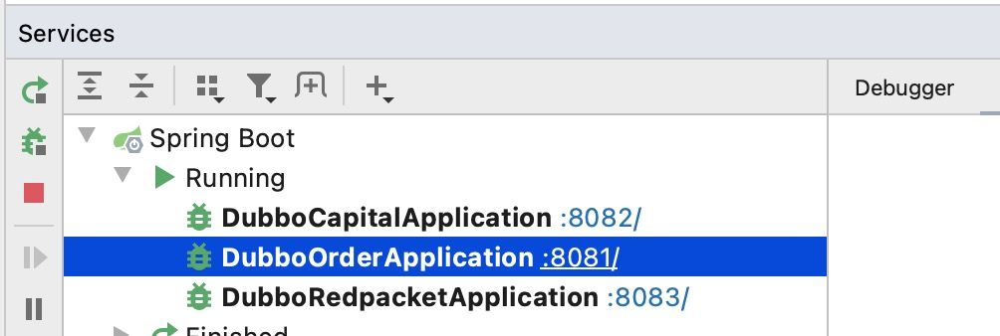
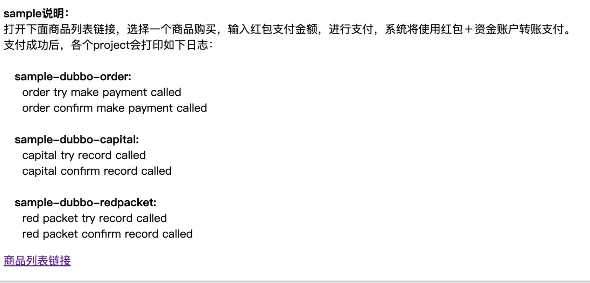
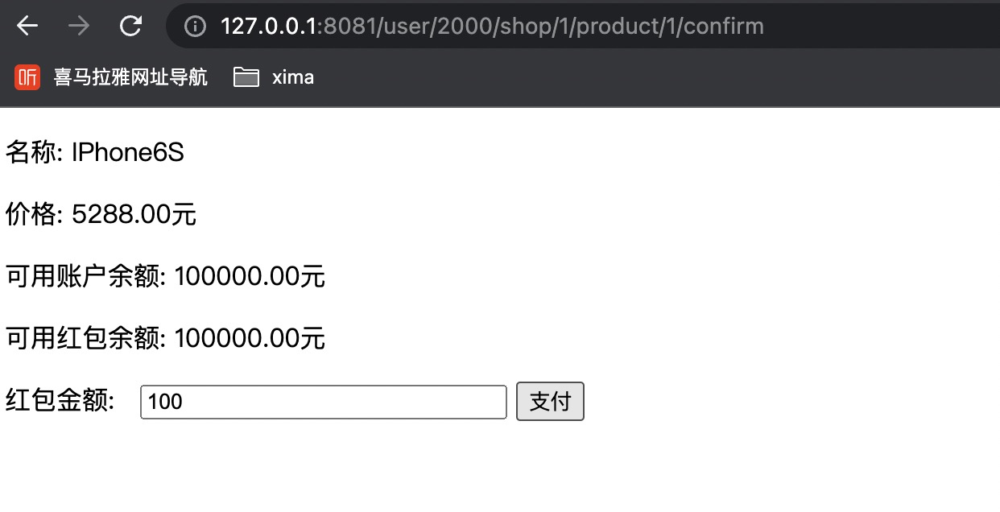
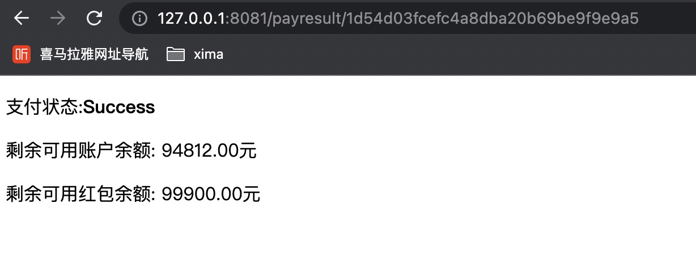

# local模式演示
local模式，即[local存储模式](/zh-cn/docs/tutorial/storagemode/local.html)  

这里用dubbo-sample来说演示**local模式**  

示例工程:[tcc-transaction-dubbo-sample](https://github.com/changmingxie/tcc-transaction/tree/master-2.x/tcc-transaction-tutorial-sample/tcc-transaction-dubbo-sample) 
> tcc-transaction-dubbo-capital(资金服务)  
> tcc-transaction-dubbo-redpacket(红包服务)  
> tcc-transaction-dubbo-order(订单服务)   

以下将一步一步教大家如何使用tcc-transaction的local模式  

## 资金服务开发
涉及两个模块的开发：  
- tcc-transaction-dubbo-capital-api，方便调用方使用接口定义 
- tcc-transaction-dubbo-capital，提供资金相关操作实现、服务暴露等功能  

### tcc-transaction-dubbo-capital-api开发
方便调用方使用资金服务的接口定义  
#### 添加maven依赖
请选用[最新版本](https://github.com/changmingxie/tcc-transaction/releases)
```xml
<!--tcc依赖-->
<dependency>
    <groupId>org.mengyun</groupId>
    <artifactId>tcc-transaction-api</artifactId>
    <version>${tcc-transaction.version}</version>
</dependency>
```

#### 声明tcc接口
查看[@EnableTcc](/zh-cn/docs/tutorial/api.html#%40enabletcc)

```java
public interface CapitalTradeOrderService {
    @EnableTcc
    public String record(CapitalTradeOrderDto tradeOrderDto);
}
```

### tcc-transaction-dubbo-capital开发  
提供资金相关操作实现、服务暴露等功能  
#### 添加maven依赖

请选用[最新版本](https://github.com/changmingxie/tcc-transaction/releases)
```xml
<!--tcc依赖-->
<dependency>
    <groupId>org.mengyun</groupId>
    <artifactId>tcc-transaction-dubbo</artifactId>
    <version>${tcc-transaction.version}</version>
</dependency>

<dependency>
    <groupId>org.mengyun</groupId>
    <artifactId>tcc-transaction-spring</artifactId>
    <version>${tcc-transaction.version}</version>
</dependency>
```


#### spring xml配置
appcontext-service-tcc.xml开发，这里提供了本地模式的两种配置，您可以选择一种配置：  
- 本地存储模式之MEMORY  
- 本地存储模式之REDIS  

##### 本地存储模式之MEMORY
```xml
<?xml version="1.0" encoding="UTF-8"?>
<beans xmlns:xsi="http://www.w3.org/2001/XMLSchema-instance"
       xmlns:tcc="http://www.tcctransaction.org/schema/tcc" xmlns="http://www.springframework.org/schema/beans"
       xsi:schemaLocation="http://www.springframework.org/schema/beans http://www.springframework.org/schema/beans/spring-beans.xsd http://www.tcctransaction.org/schema/tcc http://www.tcctransaction.org/schema/tcc.xsd">

    <!--驱动TccClient-->
    <tcc:annotation-driven client-config="clientConfig"/>

    <bean class="org.mengyun.tcctransaction.ClientConfig" id="clientConfig">
        <property name="recoveryConfig">
            <bean class="org.mengyun.tcctransaction.properties.RecoveryProperties">
                <!--开启补偿任务-->
                <property name="recoveryEnabled" value="true"/>
            </bean>
        </property>
        <property name="storeConfig">
            <bean class="org.mengyun.tcctransaction.properties.store.StoreProperties">
                <property name="domain" value="TCC:DUBBO:CAPITAL"/>
                <!--本地存储模式(MEMORY)-->
                <property name="storageType" value="MEMORY"/>
            </bean>
        </property>
    </bean>

</beans>

```

##### 本地存储模式之REDIS
```xml
<?xml version="1.0" encoding="UTF-8"?>
<beans xmlns:xsi="http://www.w3.org/2001/XMLSchema-instance"
       xmlns:tcc="http://www.tcctransaction.org/schema/tcc" xmlns="http://www.springframework.org/schema/beans"
       xsi:schemaLocation="http://www.springframework.org/schema/beans http://www.springframework.org/schema/beans/spring-beans.xsd http://www.tcctransaction.org/schema/tcc http://www.tcctransaction.org/schema/tcc.xsd">

    <!--驱动TccClient-->
    <tcc:annotation-driven client-config="clientConfig"/>

    <bean class="org.mengyun.tcctransaction.ClientConfig" id="clientConfig">
        <property name="recoveryConfig">
            <bean class="org.mengyun.tcctransaction.properties.RecoveryProperties">
                <!--开启补偿任务-->
                <property name="recoveryEnabled" value="true"/>
            </bean>
        </property>
        <property name="storeConfig">
            <bean class="org.mengyun.tcctransaction.properties.store.StoreProperties">
                <property name="domain" value="TCC:DUBBO:CAPITAL"/>
                <!--本地存储模式(REDIS)-->
                <property name="storageType" value="REDIS"/>
                <property name="redis">
                    <bean class="org.mengyun.tcctransaction.properties.store.RedisStoreProperties">
                        <property name="host" value="127.0.0.1"/>
                        <property name="port" value="6379"/>
                        <property name="database" value="0"/>
                        <property name="poolConfig">
                            <bean class="redis.clients.jedis.JedisPoolConfig">
                                <property name="maxTotal" value="100"/>
                                <property name="maxIdle" value="100"/>
                                <property name="maxWaitMillis" value="300"/>
                                <property name="minIdle" value="10"/>
                            </bean>
                        </property>
                    </bean>
                </property>
            </bean>
        </property>
    </bean>

</beans>

```

#### tcc实现
在tcc实现上方法上添加[@Compensable](/zh-cn/docs/tutorial/api.html#%40compensable)注解，设置confirmMethod和cancelMethod方法，分别为tcc的confirm和cancel方法。    

```java
public class CapitalTradeOrderServiceImpl implements CapitalTradeOrderService {
    @Compensable(confirmMethod = "confirmRecord", cancelMethod = "cancelRecord")
    public String record(CapitalTradeOrderDto tradeOrderDto) {
        // do someting ...
        return "success";
    }

    public void confirmRecord(CapitalTradeOrderDto tradeOrderDto) {
        // do something ...
    }

    public void cancelRecord(CapitalTradeOrderDto tradeOrderDto) {
        // do something ...
    }
}

```

## 红包服务开发
涉及两个模块的开发：  
- tcc-transaction-dubbo-redpacket-api，方便调用方使用接口定义 
- tcc-transaction-dubbo-redpacket，提供红包相关操作实现、服务暴露等功能  

### tcc-transaction-dubbo-redpacket-api开发
方便调用方使用资金服务的接口定义  
#### 添加maven依赖
请选用[最新版本](https://github.com/changmingxie/tcc-transaction/releases)
```xml
<!--tcc依赖-->
<dependency>
    <groupId>org.mengyun</groupId>
    <artifactId>tcc-transaction-api</artifactId>
    <version>${tcc-transaction.version}</version>
</dependency>
```

#### 声明tcc接口
查看[@EnableTcc](/zh-cn/docs/tutorial/api.html#%40enabletcc)

```java
public interface RedPacketTradeOrderService {
    @EnableTcc
    public String record(RedPacketTradeOrderDto tradeOrderDto);
}
```

### tcc-transaction-dubbo-redpacket开发  
提供红包相关操作实现、服务暴露等功能  
#### 添加maven依赖

请选用[最新版本](https://github.com/changmingxie/tcc-transaction/releases)
```xml
<!--tcc依赖-->
<dependency>
    <groupId>org.mengyun</groupId>
    <artifactId>tcc-transaction-dubbo</artifactId>
    <version>${tcc-transaction.version}</version>
</dependency>

<dependency>
    <groupId>org.mengyun</groupId>
    <artifactId>tcc-transaction-spring</artifactId>
    <version>${tcc-transaction.version}</version>
</dependency>
```


#### spring xml配置
appcontext-service-tcc.xml开发，这里提供了本地模式的两种配置，您可以选择一种配置：  
- 本地存储模式之MEMORY  
- 本地存储模式之REDIS  

##### 本地存储模式之MEMORY
```xml
<?xml version="1.0" encoding="UTF-8"?>
<beans xmlns:xsi="http://www.w3.org/2001/XMLSchema-instance"
       xmlns:tcc="http://www.tcctransaction.org/schema/tcc" xmlns="http://www.springframework.org/schema/beans"
       xsi:schemaLocation="http://www.springframework.org/schema/beans http://www.springframework.org/schema/beans/spring-beans.xsd http://www.tcctransaction.org/schema/tcc http://www.tcctransaction.org/schema/tcc.xsd">

    <!--驱动TccClient-->
    <tcc:annotation-driven client-config="clientConfig"/>

    <bean class="org.mengyun.tcctransaction.ClientConfig" id="clientConfig">
        <property name="recoveryConfig">
            <bean class="org.mengyun.tcctransaction.properties.RecoveryProperties">
                <!--开启补偿任务-->
                <property name="recoveryEnabled" value="true"/>
            </bean>
        </property>
        <property name="storeConfig">
            <bean class="org.mengyun.tcctransaction.properties.store.StoreProperties">
                <property name="domain" value="TCC:DUBBO:REDPACKET"/>
                <!--本地存储模式(MEMORY)-->
                <property name="storageType" value="MEMORY"/>
            </bean>
        </property>
    </bean>

</beans>

```

##### 本地存储模式之REDIS
```xml
<?xml version="1.0" encoding="UTF-8"?>
<beans xmlns:xsi="http://www.w3.org/2001/XMLSchema-instance"
       xmlns:tcc="http://www.tcctransaction.org/schema/tcc" xmlns="http://www.springframework.org/schema/beans"
       xsi:schemaLocation="http://www.springframework.org/schema/beans http://www.springframework.org/schema/beans/spring-beans.xsd http://www.tcctransaction.org/schema/tcc http://www.tcctransaction.org/schema/tcc.xsd">

    <!--驱动TccClient-->
    <tcc:annotation-driven client-config="clientConfig"/>

    <bean class="org.mengyun.tcctransaction.ClientConfig" id="clientConfig">
        <property name="recoveryConfig">
            <bean class="org.mengyun.tcctransaction.properties.RecoveryProperties">
                <!--开启补偿任务-->
                <property name="recoveryEnabled" value="true"/>
            </bean>
        </property>
        <property name="storeConfig">
            <bean class="org.mengyun.tcctransaction.properties.store.StoreProperties">
                <property name="domain" value="TCC:DUBBO:REDPACKET"/>
                <!--本地存储模式(REDIS)-->
                <property name="storageType" value="REDIS"/>
                <property name="redis">
                    <bean class="org.mengyun.tcctransaction.properties.store.RedisStoreProperties">
                        <property name="host" value="127.0.0.1"/>
                        <property name="port" value="6379"/>
                        <property name="database" value="0"/>
                        <property name="poolConfig">
                            <bean class="redis.clients.jedis.JedisPoolConfig">
                                <property name="maxTotal" value="100"/>
                                <property name="maxIdle" value="100"/>
                                <property name="maxWaitMillis" value="300"/>
                                <property name="minIdle" value="10"/>
                            </bean>
                        </property>
                    </bean>
                </property>
            </bean>
        </property>
    </bean>

</beans>

```

#### tcc实现
在tcc实现上方法上添加[@Compensable](/zh-cn/docs/tutorial/api.html#%40compensable)注解，设置confirmMethod和cancelMethod方法，分别为tcc的confirm和cancel方法。    

```java
public class RedPacketTradeOrderServiceImpl implements RedPacketTradeOrderService {
    @Compensable(confirmMethod = "confirmRecord", cancelMethod = "cancelRecord")
    public String record(RedPacketTradeOrderDto tradeOrderDto) {
        return "success";
    }
    public void confirmRecord(RedPacketTradeOrderDto tradeOrderDto) {
        // do something ...
    }
    public void cancelRecord(RedPacketTradeOrderDto tradeOrderDto) {
        // do something ...
    }
}

```
## 订单服务开发  
提供下单支付相关功能，只有一个模块tcc-transaction-dubbo-order   

### tcc-transaction-dubbo-order开发  
提供下单支付相关功能   

#### 添加maven依赖

请选用[最新版本](https://github.com/changmingxie/tcc-transaction/releases)
```xml
<!--tcc依赖-->
<dependency>
    <groupId>org.mengyun</groupId>
    <artifactId>tcc-transaction-dubbo</artifactId>
    <version>${tcc-transaction.version}</version>
</dependency>

<dependency>
    <groupId>org.mengyun</groupId>
    <artifactId>tcc-transaction-spring</artifactId>
    <version>${tcc-transaction.version}</version>
</dependency>


```


#### spring xml配置
appcontext-service-tcc.xml开发，这里提供了本地模式的两种配置，您可以选择一种配置：  
- 本地存储模式之MEMORY  
- 本地存储模式之REDIS  

##### 本地存储模式之MEMORY
```xml
<?xml version="1.0" encoding="UTF-8"?>
<beans xmlns:xsi="http://www.w3.org/2001/XMLSchema-instance"
       xmlns:tcc="http://www.tcctransaction.org/schema/tcc" xmlns="http://www.springframework.org/schema/beans"
       xsi:schemaLocation="http://www.springframework.org/schema/beans http://www.springframework.org/schema/beans/spring-beans.xsd http://www.tcctransaction.org/schema/tcc http://www.tcctransaction.org/schema/tcc.xsd">

    <!--驱动TccClient-->
    <tcc:annotation-driven client-config="clientConfig"/>

    <bean class="org.mengyun.tcctransaction.ClientConfig" id="clientConfig">
        <property name="recoveryConfig">
            <bean class="org.mengyun.tcctransaction.properties.RecoveryProperties">
                <!--开启补偿任务-->
                <property name="recoveryEnabled" value="true"/>
            </bean>
        </property>
        <property name="storeConfig">
            <bean class="org.mengyun.tcctransaction.properties.store.StoreProperties">
                <property name="domain" value="TCC:DUBBO:ORDER"/>
                <!--本地存储模式(MEMORY)-->
                <property name="storageType" value="MEMORY"/>
            </bean>
        </property>
    </bean>

</beans>

```

##### 本地存储模式之REDIS
```xml
<?xml version="1.0" encoding="UTF-8"?>
<beans xmlns:xsi="http://www.w3.org/2001/XMLSchema-instance"
       xmlns:tcc="http://www.tcctransaction.org/schema/tcc" xmlns="http://www.springframework.org/schema/beans"
       xsi:schemaLocation="http://www.springframework.org/schema/beans http://www.springframework.org/schema/beans/spring-beans.xsd http://www.tcctransaction.org/schema/tcc http://www.tcctransaction.org/schema/tcc.xsd">

    <!--驱动TccClient-->
    <tcc:annotation-driven client-config="clientConfig"/>

    <bean class="org.mengyun.tcctransaction.ClientConfig" id="clientConfig">
        <property name="recoveryConfig">
            <bean class="org.mengyun.tcctransaction.properties.RecoveryProperties">
                <!--开启补偿任务-->
                <property name="recoveryEnabled" value="true"/>
            </bean>
        </property>
        <property name="storeConfig">
            <bean class="org.mengyun.tcctransaction.properties.store.StoreProperties">
                <property name="domain" value="TCC:DUBBO:ORDER"/>
                <!--本地存储模式(REDIS)-->
                <property name="storageType" value="REDIS"/>
                <property name="redis">
                    <bean class="org.mengyun.tcctransaction.properties.store.RedisStoreProperties">
                        <property name="host" value="127.0.0.1"/>
                        <property name="port" value="6379"/>
                        <property name="database" value="0"/>
                        <property name="poolConfig">
                            <bean class="redis.clients.jedis.JedisPoolConfig">
                                <property name="maxTotal" value="100"/>
                                <property name="maxIdle" value="100"/>
                                <property name="maxWaitMillis" value="300"/>
                                <property name="minIdle" value="10"/>
                            </bean>
                        </property>
                    </bean>
                </property>
            </bean>
        </property>
    </bean>

</beans>

```

#### tcc实现
在tcc实现上方法上添加[@Compensable](/zh-cn/docs/tutorial/api.html#%40compensable)注解，设置confirmMethod和cancelMethod方法，分别为tcc的confirm和cancel方法。    

```java
@Service
public class PaymentServiceImpl {
    @Compensable(confirmMethod = "confirmMakePayment", cancelMethod = "cancelMakePayment", asyncConfirm = false)
    public void makePayment(@UniqueIdentity String orderNo) {
        String result = capitalTradeOrderService.record(buildCapitalTradeOrderDto(order));
        String result2 = redPacketTradeOrderService.record(buildRedPacketTradeOrderDto(order));
    }
    public void confirmMakePayment(String orderNo) {
        // do something ...
    }
    public void cancelMakePayment(String orderNo) {
        // do something ...
    }
}

```

## dashboard部署
TODO 待完善  
## 服务启动并演示
### 本地idea启动
分别启动tcc-transaction-dubbo-capital、tcc-transaction-dubbo-redpacket、tcc-transaction-dubbo-order

 
##### 页面演示
测试页面入口：http://localhost:8081 
  
选择购买商品

点击支付按钮

##### 日志显示
try阶段
```text
1、order try make payment called.time seq:2022-07-13 17:46:04
2、capital try record called. time seq:2022-07-13 17:46:06
3、red packet try record called. time seq:2022-07-13 17:46:07
```
confirm阶段
```text
1、order confirm make payment called. time seq:2022-07-13 17:46:08
2、capital confirm record called. time seq:2022-07-13 17:46:09
3、red packet confirm record called. time seq:2022-07-13 17:46:10
```
恭喜你，顺序正确说明dubbo-sample项目运行成功。
